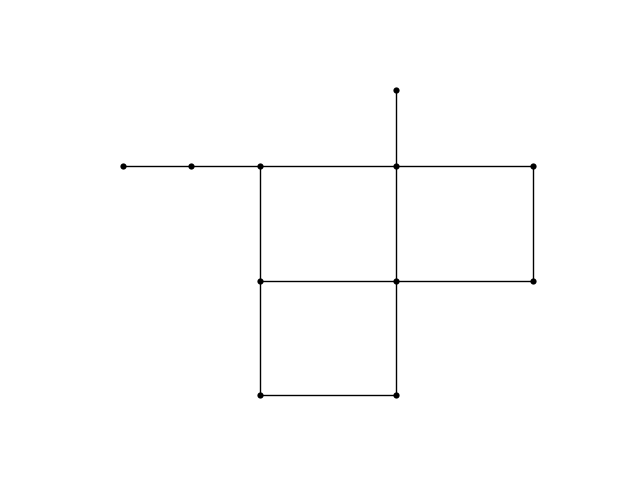
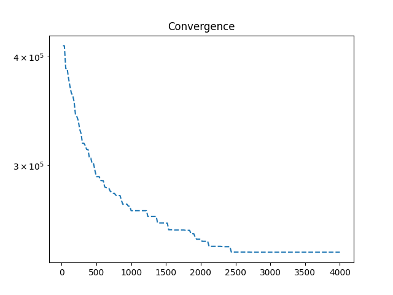
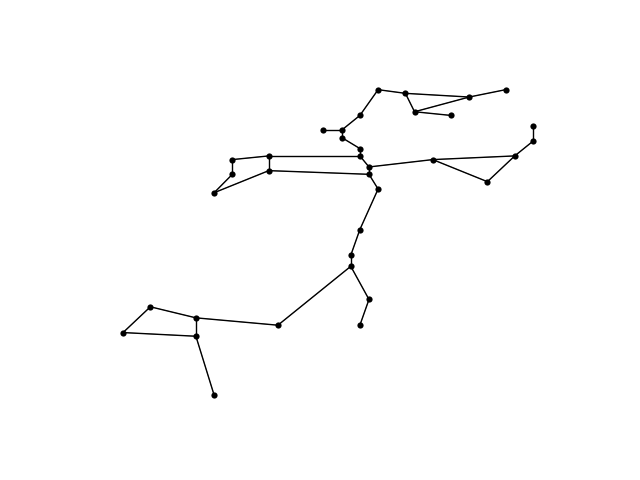

# WATER NETWORK RESILIENCE TOOL - OPTIMIZATION

We are performing cost optimization of a water network system using water network resilience tool (WNTR).

## MATHEMATICAL FORMULATION

### Decision variables:

Decision variables are diameters $x_i$ for each pipe with index $i$.

The objective is to minimize the total cost of the pipes while satisfying certain constraints. Decision variables (diameter sizes) are constrained in these boundaries:

$lowerBound<=x_i<=upperBound$ where lowerBound is set to 0.1 and upperBound is set to 0.762.

### Objective function:

$$MIN f(x) = \sum_{i=1}^{n}{Cost(x_i)\cdot l_i}$$

where $Cost(x_i)$ represents a cost of each pipe, $l_i$ represents a length of a pipe. Pipe cost is directly connected to a diametar size.

Each diemeter size has a specific cost. Cost is given in the Table 1.

<table border="1">
  <tr>
    <th>Diameter (in)</th>
    <th>Diameter (m)</th>
    <th>Annual Cost ($/m/yr)</th>
  </tr>
  <tr>
    <td>4</td>
    <td>0.102</td>
    <td>8.31</td>
  </tr>
  <tr>
    <td>6</td>
    <td>0.152</td>
    <td>10.10</td>
  </tr>
  <tr>
    <td>8</td>
    <td>0.203</td>
    <td>12.10</td>
  </tr>
  <tr>
    <td>10</td>
    <td>0.254</td>
    <td>12.96</td>
  </tr>
  <tr>
    <td>12</td>
    <td>0.305</td>
    <td>15.22</td>
  </tr>
  <tr>
    <td>14</td>
    <td>0.356</td>
    <td>16.62</td>
  </tr>
  <tr>
    <td>16</td>
    <td>0.406</td>
    <td>19.41</td>
  </tr>
  <tr>
    <td>18</td>
    <td>0.457</td>
    <td>22.20</td>
  </tr>
  <tr>
    <td>20</td>
    <td>0.508</td>
    <td>24.66</td>
  </tr>
  <tr>
    <td>24</td>
    <td>0.610</td>
    <td>35.69</td>
  </tr>
  <tr>
    <td>28</td>
    <td>0.711</td>
    <td>40.08</td>
  </tr>
  <tr>
    <td>30</td>
    <td>0.762</td>
    <td>42.60</td>
  </tr>
</table>

### Constraints:

We have implicit and explicit constraints.

<b>Implicit system constraints:</b> Conservations of mass and energy are maintained through EPANET simulator and because of that they are called implicit constraints

<b>Explicit constraints</b>

#### Pressure constraint


We also want to maintain junction pressure levels above and below specific thresholds. 

$P_{low}<=P_{node}<=P_{high}$.

This is maintained using a penalty function on a minimization objective.

$P_{low} = \sum_{node} max(0, P_{min}-P_{node})$

$P_{high} = \sum_{node} max(0, P_{node}-P_{max})$

$P_{pressure}=P_{low}+P_{high}$.

#### Resilience constraint

Besides pressure constraints we introduce a resilience constraint where we want to maintain overall resilience of a system above a resilience threshold.

$MRI_{current}>=MRI_{target}$

We are interested in a Modified Resilience Index (MRI). The modified resilience index is the total surplus power available at demand junctions as a percentage of the total minimum required power at demand junctions. The metric can be computed as a timeseries for each junction or as a system average timeseries. We use mean value of a total system average timesires and maintain the resilience metric with another penalty constraint.

$MRI =\frac{∑_{j=1}^N q_j (ha_j − hr_j)}{∑_{j=1}^N q_jhr_j}\times 100$.

Penalty resilience is calculated as:

$P_{resilience}=max(0, MRI_{target}-MRI_{current})$

#### Pipe criticality constraint

We perform criticality analysis by doing <b>n+1</b> simulations where we turn off one pipe at a time and calculate number of impacted junctions by that closure. Finally we find a total number of impacted junctions and create a penalty function for our cost function. We set a threshold for junctions impacted as maxJunctions, and simJunctions as a total number of impacted junctions. We want to minimize the number of impacted junctions affected through pipe criticality analysis.

$P_{junction} = max(0, maxJunctions - simJunctions)$

### FINAL OBJECTIVE FUNCTION

$$MIN f(x) = \sum_{i=1}^{n} Cost(x_i)\cdot l_i +P_{pressure}+P_{resilience}+P_{junction}$$

## CODE STRUCTURE

networks -> holds INP files of benchmark networks (Net1, Net2, Net3).

main.py -> starting point of our program, where we define thresholds, print starting values of cost, pressures, diameters and mri. Call optimization and then print final values

network.py -> all wntr helper functions that we use, like file include, simulation run, pressure extractions, mri calculation, cost calculation, diameters update and etc.

optimization.py -> definition of optimization algorithm and proces, and definition of an objective function (uses pymoo library for optimization).

## EXAMPLE 1 - NET1 with pipe criticality analysis

Cost optimization of Net1 with GA and population size = 20 and number of iterations = 200.

Population size of 20 and 200 iterations give 4000 combinations. Also for each combination we do n+1 simulation (One simulation with all closed pipes) and then n simulations for each pipe that we close (We don't close pipe 10 because that is the first pipe and that pipe affects all nodes -> breaks the network). So finally we have 4000 * 12 (n+1 simulations where n is 11) = 48 000 simulations.

$$MIN f(x) = \sum_{i=1}^{n} Cost(x_i)\cdot l_i +P_{pressure}+P_{resilience}+P_{junction}$$

### Visualization of network

We have not included first pipe (Pipe number 10) in our analysis because that is the critical pipe that when turned off affects all other pipes (Start of the network).



### Initial costs and descriptions

Initial pipe cost:  <b>282367.08576000005</b>

We set these constraints: 

Maximum pressure:  100

Minimum pressure:  3.516

Initial junction impact is 0, so we want to maintain it and set it to the 0 also.

Initial MRI:  0.3715616328549535 so we set a target MRI for our optimized network to be 0.35.

### Convergence plot:



### Final results and constraints check:

Final cost: <b>238469.45448000001</b>

Final MRI: 0.35037240703556666

Final junction impact: 0

Minimum and maximum pressure constraints are satisfied also.

```
Program starts
Initial pipe cost:  282367.08576000005
Initial Pipe Diameters:
10     0.4572
11     0.3556
12     0.2540
21     0.2540
22     0.3048
31     0.1524
110    0.4572
111    0.2540
112    0.3048
113    0.2032
121    0.2032
122    0.1524
dtype: float64
Initial simulation starting
Starting list of pressures:
name          10         11         12  ...         32    9          2
0      89.717072  83.890205  82.317276  ...  77.934052  0.0  36.575996
3600   90.454903  84.729370  83.251549  ...  78.848038  0.0  37.511158
7200   90.917625  85.255707  84.155121  ...  78.706932  0.0  38.424835
10800  91.417023  85.823837  84.786263  ...  79.322838  0.0  39.056423
14400  91.644485  86.082626  85.396568  ...  78.709221  0.0  39.673260
18000  91.915337  86.390800  85.737999  ...  79.041924  0.0  40.014839
21600  91.920364  86.396507  86.068512  ...  77.989807  0.0  40.348347
25200  91.971924  86.455208  86.133324  ...  78.052925  0.0  40.413197
28800  92.281357  86.807297  86.199440  ...  79.491776  0.0  40.476486
32400  92.537117  87.098328  86.521896  ...  79.806046  0.0  40.799053
36000  93.043617  87.674759  86.842422  ...  81.329041  0.0  41.113953
39600  93.492668  88.185890  87.410179  ...  81.882828  0.0  41.682087
43200  94.181038  88.969505  87.972603  ...  83.464218  0.0  42.236603
46800  84.221161  84.221161  87.737000  ...  81.997169  0.0  42.058586
50400  83.050964  83.050964  86.408432  ...  81.579819  0.0  40.715950
54000  81.976852  81.976852  85.334328  ...  80.505707  0.0  39.641838
57600  81.041916  81.041916  84.271576  ...  80.178398  0.0  38.567730
61200  80.236328  80.236328  83.465996  ...  79.372803  0.0  37.762142
64800  79.535202  79.535202  82.668922  ...  79.127670  0.0  36.956554
68400  78.998131  78.998131  82.131859  ...  78.590607  0.0  36.419487
72000  78.356628  78.356628  81.586273  ...  77.493088  0.0  35.882423
75600  77.551041  77.551041  80.780685  ...  76.687500  0.0  35.076836
79200  76.606262  76.606262  79.963730  ...  75.135109  0.0  34.271248
82800  87.873459  81.793999  79.674538  ...  76.132500  0.0  33.917763
86400  88.610832  82.632294  80.916878  ...  76.563751  0.0  35.174244

[25 rows x 11 columns]
Maximum pressure:  94.18104
Minimum pressure:  0.0
Initial junction impact: 0
Initial MRI:  0.3715616328549535

=================================================================================
n_gen  |  n_eval  |     cv_min    |     cv_avg    |     f_avg     |     f_min    
=================================================================================
     1 |       20 |  0.000000E+00 |  4.495772E+02 |  4.645597E+05 |  4.118726E+05
     2 |       40 |  0.000000E+00 |  3.5000000000 |  4.721179E+05 |  4.118726E+05
     3 |       60 |  0.000000E+00 |  0.1500000000 |  4.603828E+05 |  3.878129E+05
     4 |       80 |  0.000000E+00 |  0.000000E+00 |  4.172938E+05 |  3.878129E+05
     5 |      100 |  0.000000E+00 |  0.000000E+00 |  4.011535E+05 |  3.779637E+05
     6 |      120 |  0.000000E+00 |  0.000000E+00 |  3.898665E+05 |  3.700618E+05
     7 |      140 |  0.000000E+00 |  0.000000E+00 |  3.778533E+05 |  3.634313E+05
     8 |      160 |  0.000000E+00 |  0.000000E+00 |  3.688924E+05 |  3.612115E+05
     9 |      180 |  0.000000E+00 |  0.000000E+00 |  3.643480E+05 |  3.551443E+05
    10 |      200 |  0.000000E+00 |  0.000000E+00 |  3.591145E+05 |  3.430420E+05
    11 |      220 |  0.000000E+00 |  0.000000E+00 |  3.545223E+05 |  3.413833E+05
    12 |      240 |  0.000000E+00 |  0.000000E+00 |  3.470101E+05 |  3.378589E+05
    13 |      260 |  0.000000E+00 |  0.000000E+00 |  3.411933E+05 |  3.302156E+05
    14 |      280 |  0.000000E+00 |  0.000000E+00 |  3.370086E+05 |  3.265130E+05
    15 |      300 |  0.000000E+00 |  0.000000E+00 |  3.304738E+05 |  3.182099E+05
    16 |      320 |  0.000000E+00 |  0.000000E+00 |  3.252941E+05 |  3.182099E+05
    17 |      340 |  0.000000E+00 |  0.000000E+00 |  3.225211E+05 |  3.162947E+05
    18 |      360 |  0.000000E+00 |  0.000000E+00 |  3.200548E+05 |  3.130761E+05
    19 |      380 |  0.000000E+00 |  0.000000E+00 |  3.176601E+05 |  3.130761E+05
    20 |      400 |  0.000000E+00 |  0.000000E+00 |  3.149725E+05 |  3.058812E+05
    21 |      420 |  0.000000E+00 |  0.000000E+00 |  3.115099E+05 |  3.058812E+05
    22 |      440 |  0.000000E+00 |  0.000000E+00 |  3.073587E+05 |  3.013911E+05
    23 |      460 |  0.000000E+00 |  0.000000E+00 |  3.053921E+05 |  3.013911E+05
    24 |      480 |  0.000000E+00 |  0.000000E+00 |  3.033187E+05 |  2.959193E+05
    25 |      500 |  0.000000E+00 |  0.000000E+00 |  3.002923E+05 |  2.913166E+05
    26 |      520 |  0.000000E+00 |  0.000000E+00 |  2.968619E+05 |  2.913166E+05
    27 |      540 |  0.000000E+00 |  0.000000E+00 |  2.941210E+05 |  2.913166E+05
    28 |      560 |  0.000000E+00 |  0.000000E+00 |  2.921185E+05 |  2.884359E+05
    29 |      580 |  0.000000E+00 |  0.000000E+00 |  2.907236E+05 |  2.880979E+05
    30 |      600 |  0.000000E+00 |  0.000000E+00 |  2.896479E+05 |  2.880979E+05
    31 |      620 |  0.000000E+00 |  0.000000E+00 |  2.878887E+05 |  2.834147E+05
    32 |      640 |  0.000000E+00 |  0.000000E+00 |  2.868507E+05 |  2.829641E+05
    33 |      660 |  0.000000E+00 |  0.000000E+00 |  2.854403E+05 |  2.829641E+05
    34 |      680 |  0.000000E+00 |  0.000000E+00 |  2.837420E+05 |  2.824044E+05
    35 |      700 |  0.000000E+00 |  0.000000E+00 |  2.826189E+05 |  2.801961E+05
    36 |      720 |  0.000000E+00 |  0.000000E+00 |  2.814817E+05 |  2.795237E+05
    37 |      740 |  0.000000E+00 |  0.000000E+00 |  2.798687E+05 |  2.786546E+05
    38 |      760 |  0.000000E+00 |  0.000000E+00 |  2.796183E+05 |  2.786546E+05
    39 |      780 |  0.000000E+00 |  0.000000E+00 |  2.792491E+05 |  2.772706E+05
    40 |      800 |  0.000000E+00 |  0.000000E+00 |  2.789402E+05 |  2.771206E+05
    41 |      820 |  0.000000E+00 |  0.000000E+00 |  2.780662E+05 |  2.771206E+05
    42 |      840 |  0.000000E+00 |  0.000000E+00 |  2.773882E+05 |  2.771206E+05
    43 |      860 |  0.000000E+00 |  0.000000E+00 |  2.769528E+05 |  2.736335E+05
    44 |      880 |  0.000000E+00 |  0.000000E+00 |  2.764120E+05 |  2.707527E+05
    45 |      900 |  0.000000E+00 |  0.000000E+00 |  2.753851E+05 |  2.707527E+05
    46 |      920 |  0.000000E+00 |  0.000000E+00 |  2.732578E+05 |  2.707527E+05
    47 |      940 |  0.000000E+00 |  0.000000E+00 |  2.718935E+05 |  2.707527E+05
    48 |      960 |  0.000000E+00 |  0.000000E+00 |  2.711769E+05 |  2.693687E+05
    49 |      980 |  0.000000E+00 |  0.000000E+00 |  2.705451E+05 |  2.693687E+05
    50 |     1000 |  0.000000E+00 |  0.000000E+00 |  2.702458E+05 |  2.661500E+05
    51 |     1020 |  0.000000E+00 |  0.000000E+00 |  2.700382E+05 |  2.661500E+05
    52 |     1040 |  0.000000E+00 |  0.000000E+00 |  2.693011E+05 |  2.661500E+05
    53 |     1060 |  0.000000E+00 |  0.000000E+00 |  2.684031E+05 |  2.661500E+05
    54 |     1080 |  0.000000E+00 |  0.000000E+00 |  2.679034E+05 |  2.661500E+05
    55 |     1100 |  0.000000E+00 |  0.000000E+00 |  2.664717E+05 |  2.661500E+05
    56 |     1120 |  0.000000E+00 |  0.000000E+00 |  2.661500E+05 |  2.661500E+05
    57 |     1140 |  0.000000E+00 |  0.000000E+00 |  2.661500E+05 |  2.661500E+05
    58 |     1160 |  0.000000E+00 |  0.000000E+00 |  2.661500E+05 |  2.661500E+05
    59 |     1180 |  0.000000E+00 |  0.000000E+00 |  2.661500E+05 |  2.661500E+05
    60 |     1200 |  0.000000E+00 |  0.000000E+00 |  2.661500E+05 |  2.661500E+05
    61 |     1220 |  0.000000E+00 |  0.000000E+00 |  2.661500E+05 |  2.661500E+05
    62 |     1240 |  0.000000E+00 |  0.000000E+00 |  2.659521E+05 |  2.621910E+05
    63 |     1260 |  0.000000E+00 |  0.000000E+00 |  2.655487E+05 |  2.621910E+05
    64 |     1280 |  0.000000E+00 |  0.000000E+00 |  2.643535E+05 |  2.621910E+05
    65 |     1300 |  0.000000E+00 |  0.000000E+00 |  2.632661E+05 |  2.621910E+05
    66 |     1320 |  0.000000E+00 |  0.000000E+00 |  2.621910E+05 |  2.621910E+05
    67 |     1340 |  0.000000E+00 |  0.000000E+00 |  2.621910E+05 |  2.621910E+05
    68 |     1360 |  0.000000E+00 |  0.000000E+00 |  2.621910E+05 |  2.621910E+05
    69 |     1380 |  0.000000E+00 |  0.000000E+00 |  2.617345E+05 |  2.577010E+05
    70 |     1400 |  0.000000E+00 |  0.000000E+00 |  2.609731E+05 |  2.577010E+05
    71 |     1420 |  0.000000E+00 |  0.000000E+00 |  2.593940E+05 |  2.577010E+05
    72 |     1440 |  0.000000E+00 |  0.000000E+00 |  2.577010E+05 |  2.577010E+05
    73 |     1460 |  0.000000E+00 |  0.000000E+00 |  2.577010E+05 |  2.577010E+05
    74 |     1480 |  0.000000E+00 |  0.000000E+00 |  2.577010E+05 |  2.577010E+05
    75 |     1500 |  0.000000E+00 |  0.000000E+00 |  2.576935E+05 |  2.575510E+05
    76 |     1520 |  0.000000E+00 |  0.000000E+00 |  2.576785E+05 |  2.575510E+05
    77 |     1540 |  0.000000E+00 |  0.000000E+00 |  2.574165E+05 |  2.530609E+05
    78 |     1560 |  0.000000E+00 |  0.000000E+00 |  2.569375E+05 |  2.530609E+05
    79 |     1580 |  0.000000E+00 |  0.000000E+00 |  2.563639E+05 |  2.530609E+05
    80 |     1600 |  0.000000E+00 |  0.000000E+00 |  2.551608E+05 |  2.530609E+05
    81 |     1620 |  0.000000E+00 |  0.000000E+00 |  2.533724E+05 |  2.528909E+05
    82 |     1640 |  0.000000E+00 |  0.000000E+00 |  2.530439E+05 |  2.528909E+05
    83 |     1660 |  0.000000E+00 |  0.000000E+00 |  2.530269E+05 |  2.528909E+05
    84 |     1680 |  0.000000E+00 |  0.000000E+00 |  2.530014E+05 |  2.528909E+05
    85 |     1700 |  0.000000E+00 |  0.000000E+00 |  2.529334E+05 |  2.528909E+05
    86 |     1720 |  0.000000E+00 |  0.000000E+00 |  2.528909E+05 |  2.528909E+05
    87 |     1740 |  0.000000E+00 |  0.000000E+00 |  2.528909E+05 |  2.528909E+05
    88 |     1760 |  0.000000E+00 |  0.000000E+00 |  2.528909E+05 |  2.528909E+05
    89 |     1780 |  0.000000E+00 |  0.000000E+00 |  2.528823E+05 |  2.527208E+05
    90 |     1800 |  0.000000E+00 |  0.000000E+00 |  2.528738E+05 |  2.527208E+05
    91 |     1820 |  0.000000E+00 |  0.000000E+00 |  2.528483E+05 |  2.527208E+05
    92 |     1840 |  0.000000E+00 |  0.000000E+00 |  2.528228E+05 |  2.527208E+05
    93 |     1860 |  0.000000E+00 |  0.000000E+00 |  2.526421E+05 |  2.504677E+05
    94 |     1880 |  0.000000E+00 |  0.000000E+00 |  2.524520E+05 |  2.504677E+05
    95 |     1900 |  0.000000E+00 |  0.000000E+00 |  2.520568E+05 |  2.504677E+05
    96 |     1920 |  0.000000E+00 |  0.000000E+00 |  2.511069E+05 |  2.482146E+05
    97 |     1940 |  0.000000E+00 |  0.000000E+00 |  2.498095E+05 |  2.468306E+05
    98 |     1960 |  0.000000E+00 |  0.000000E+00 |  2.488959E+05 |  2.468306E+05
    99 |     1980 |  0.000000E+00 |  0.000000E+00 |  2.477587E+05 |  2.468306E+05
   100 |     2000 |  0.000000E+00 |  0.000000E+00 |  2.468306E+05 |  2.468306E+05
   101 |     2020 |  0.000000E+00 |  0.000000E+00 |  2.467614E+05 |  2.454465E+05
   102 |     2040 |  0.000000E+00 |  0.000000E+00 |  2.466230E+05 |  2.454465E+05
   103 |     2060 |  0.000000E+00 |  0.000000E+00 |  2.462770E+05 |  2.454465E+05
   104 |     2080 |  0.000000E+00 |  0.000000E+00 |  2.459267E+05 |  2.454465E+05
   105 |     2100 |  0.000000E+00 |  0.000000E+00 |  2.454465E+05 |  2.454465E+05
   106 |     2120 |  0.000000E+00 |  0.000000E+00 |  2.452856E+05 |  2.422279E+05
   107 |     2140 |  0.000000E+00 |  0.000000E+00 |  2.451247E+05 |  2.422279E+05
   108 |     2160 |  0.000000E+00 |  0.000000E+00 |  2.449426E+05 |  2.422279E+05
   109 |     2180 |  0.000000E+00 |  0.000000E+00 |  2.444174E+05 |  2.422279E+05
   110 |     2200 |  0.000000E+00 |  0.000000E+00 |  2.430171E+05 |  2.422279E+05
   111 |     2220 |  0.000000E+00 |  0.000000E+00 |  2.422279E+05 |  2.422279E+05
   112 |     2240 |  0.000000E+00 |  0.000000E+00 |  2.422279E+05 |  2.422279E+05
   113 |     2260 |  0.000000E+00 |  0.000000E+00 |  2.422279E+05 |  2.422279E+05
   114 |     2280 |  0.000000E+00 |  0.000000E+00 |  2.422279E+05 |  2.422279E+05
   115 |     2300 |  0.000000E+00 |  0.000000E+00 |  2.422236E+05 |  2.421425E+05
   116 |     2320 |  0.000000E+00 |  0.000000E+00 |  2.422124E+05 |  2.420047E+05
   117 |     2340 |  0.000000E+00 |  0.000000E+00 |  2.421970E+05 |  2.420047E+05
   118 |     2360 |  0.000000E+00 |  0.000000E+00 |  2.421688E+05 |  2.420047E+05
   119 |     2380 |  0.000000E+00 |  0.000000E+00 |  2.421209E+05 |  2.420047E+05
   120 |     2400 |  0.000000E+00 |  0.000000E+00 |  2.420805E+05 |  2.420047E+05
   121 |     2420 |  0.000000E+00 |  0.000000E+00 |  2.420254E+05 |  2.420047E+05
   122 |     2440 |  0.000000E+00 |  0.000000E+00 |  2.418306E+05 |  2.385219E+05
   123 |     2460 |  0.000000E+00 |  0.000000E+00 |  2.418306E+05 |  2.385219E+05
   124 |     2480 |  0.000000E+00 |  0.000000E+00 |  2.416565E+05 |  2.385219E+05
   125 |     2500 |  0.000000E+00 |  0.000000E+00 |  2.414823E+05 |  2.385219E+05
   126 |     2520 |  0.000000E+00 |  0.000000E+00 |  2.413082E+05 |  2.385219E+05
   127 |     2540 |  0.000000E+00 |  0.000000E+00 |  2.409599E+05 |  2.385219E+05
   128 |     2560 |  0.000000E+00 |  0.000000E+00 |  2.395667E+05 |  2.385219E+05
   129 |     2580 |  0.000000E+00 |  0.000000E+00 |  2.385219E+05 |  2.385219E+05
   130 |     2600 |  0.000000E+00 |  0.000000E+00 |  2.385219E+05 |  2.385219E+05
   131 |     2620 |  0.000000E+00 |  0.000000E+00 |  2.385219E+05 |  2.385219E+05
   132 |     2640 |  0.000000E+00 |  0.000000E+00 |  2.385219E+05 |  2.385219E+05
   133 |     2660 |  0.000000E+00 |  0.000000E+00 |  2.385219E+05 |  2.385219E+05
   134 |     2680 |  0.000000E+00 |  0.000000E+00 |  2.385219E+05 |  2.385219E+05
   135 |     2700 |  0.000000E+00 |  0.000000E+00 |  2.385219E+05 |  2.385219E+05
   136 |     2720 |  0.000000E+00 |  0.000000E+00 |  2.385193E+05 |  2.384695E+05
   137 |     2740 |  0.000000E+00 |  0.000000E+00 |  2.385140E+05 |  2.384695E+05
   138 |     2760 |  0.000000E+00 |  0.000000E+00 |  2.385035E+05 |  2.384695E+05
   139 |     2780 |  0.000000E+00 |  0.000000E+00 |  2.384852E+05 |  2.384695E+05
   140 |     2800 |  0.000000E+00 |  0.000000E+00 |  2.384695E+05 |  2.384695E+05
   141 |     2820 |  0.000000E+00 |  0.000000E+00 |  2.384695E+05 |  2.384695E+05
   142 |     2840 |  0.000000E+00 |  0.000000E+00 |  2.384695E+05 |  2.384695E+05
   143 |     2860 |  0.000000E+00 |  0.000000E+00 |  2.384695E+05 |  2.384695E+05
   144 |     2880 |  0.000000E+00 |  0.000000E+00 |  2.384695E+05 |  2.384695E+05
   145 |     2900 |  0.000000E+00 |  0.000000E+00 |  2.384695E+05 |  2.384695E+05
   146 |     2920 |  0.000000E+00 |  0.000000E+00 |  2.384695E+05 |  2.384695E+05
   147 |     2940 |  0.000000E+00 |  0.000000E+00 |  2.384695E+05 |  2.384695E+05
   148 |     2960 |  0.000000E+00 |  0.000000E+00 |  2.384695E+05 |  2.384695E+05
   149 |     2980 |  0.000000E+00 |  0.000000E+00 |  2.384695E+05 |  2.384695E+05
   150 |     3000 |  0.000000E+00 |  0.000000E+00 |  2.384695E+05 |  2.384695E+05
   151 |     3020 |  0.000000E+00 |  0.000000E+00 |  2.384695E+05 |  2.384695E+05
   152 |     3040 |  0.000000E+00 |  0.000000E+00 |  2.384695E+05 |  2.384695E+05
   153 |     3060 |  0.000000E+00 |  0.000000E+00 |  2.384695E+05 |  2.384695E+05
   154 |     3080 |  0.000000E+00 |  0.000000E+00 |  2.384695E+05 |  2.384695E+05
   155 |     3100 |  0.000000E+00 |  0.000000E+00 |  2.384695E+05 |  2.384695E+05
   156 |     3120 |  0.000000E+00 |  0.000000E+00 |  2.384695E+05 |  2.384695E+05
   157 |     3140 |  0.000000E+00 |  0.000000E+00 |  2.384695E+05 |  2.384695E+05
   158 |     3160 |  0.000000E+00 |  0.000000E+00 |  2.384695E+05 |  2.384695E+05
   159 |     3180 |  0.000000E+00 |  0.000000E+00 |  2.384695E+05 |  2.384695E+05
   160 |     3200 |  0.000000E+00 |  0.000000E+00 |  2.384695E+05 |  2.384695E+05
   161 |     3220 |  0.000000E+00 |  0.000000E+00 |  2.384695E+05 |  2.384695E+05
   162 |     3240 |  0.000000E+00 |  0.000000E+00 |  2.384695E+05 |  2.384695E+05
   163 |     3260 |  0.000000E+00 |  0.000000E+00 |  2.384695E+05 |  2.384695E+05
   164 |     3280 |  0.000000E+00 |  0.000000E+00 |  2.384695E+05 |  2.384695E+05
   165 |     3300 |  0.000000E+00 |  0.000000E+00 |  2.384695E+05 |  2.384695E+05
   166 |     3320 |  0.000000E+00 |  0.000000E+00 |  2.384695E+05 |  2.384695E+05
   167 |     3340 |  0.000000E+00 |  0.000000E+00 |  2.384695E+05 |  2.384695E+05
   168 |     3360 |  0.000000E+00 |  0.000000E+00 |  2.384695E+05 |  2.384695E+05
   169 |     3380 |  0.000000E+00 |  0.000000E+00 |  2.384695E+05 |  2.384695E+05
   170 |     3400 |  0.000000E+00 |  0.000000E+00 |  2.384695E+05 |  2.384695E+05
   171 |     3420 |  0.000000E+00 |  0.000000E+00 |  2.384695E+05 |  2.384695E+05
   172 |     3440 |  0.000000E+00 |  0.000000E+00 |  2.384695E+05 |  2.384695E+05
   173 |     3460 |  0.000000E+00 |  0.000000E+00 |  2.384695E+05 |  2.384695E+05
   174 |     3480 |  0.000000E+00 |  0.000000E+00 |  2.384695E+05 |  2.384695E+05
   175 |     3500 |  0.000000E+00 |  0.000000E+00 |  2.384695E+05 |  2.384695E+05
   176 |     3520 |  0.000000E+00 |  0.000000E+00 |  2.384695E+05 |  2.384695E+05
   177 |     3540 |  0.000000E+00 |  0.000000E+00 |  2.384695E+05 |  2.384695E+05
   178 |     3560 |  0.000000E+00 |  0.000000E+00 |  2.384695E+05 |  2.384695E+05
   179 |     3580 |  0.000000E+00 |  0.000000E+00 |  2.384695E+05 |  2.384695E+05
   180 |     3600 |  0.000000E+00 |  0.000000E+00 |  2.384695E+05 |  2.384695E+05
   181 |     3620 |  0.000000E+00 |  0.000000E+00 |  2.384695E+05 |  2.384695E+05
   182 |     3640 |  0.000000E+00 |  0.000000E+00 |  2.384695E+05 |  2.384695E+05
   183 |     3660 |  0.000000E+00 |  0.000000E+00 |  2.384695E+05 |  2.384695E+05
   184 |     3680 |  0.000000E+00 |  0.000000E+00 |  2.384695E+05 |  2.384695E+05
   185 |     3700 |  0.000000E+00 |  0.000000E+00 |  2.384695E+05 |  2.384695E+05
   186 |     3720 |  0.000000E+00 |  0.000000E+00 |  2.384695E+05 |  2.384695E+05
   187 |     3740 |  0.000000E+00 |  0.000000E+00 |  2.384695E+05 |  2.384695E+05
   188 |     3760 |  0.000000E+00 |  0.000000E+00 |  2.384695E+05 |  2.384695E+05
   189 |     3780 |  0.000000E+00 |  0.000000E+00 |  2.384695E+05 |  2.384695E+05
   190 |     3800 |  0.000000E+00 |  0.000000E+00 |  2.384695E+05 |  2.384695E+05
   191 |     3820 |  0.000000E+00 |  0.000000E+00 |  2.384695E+05 |  2.384695E+05
   192 |     3840 |  0.000000E+00 |  0.000000E+00 |  2.384695E+05 |  2.384695E+05
   193 |     3860 |  0.000000E+00 |  0.000000E+00 |  2.384695E+05 |  2.384695E+05
   194 |     3880 |  0.000000E+00 |  0.000000E+00 |  2.384695E+05 |  2.384695E+05
   195 |     3900 |  0.000000E+00 |  0.000000E+00 |  2.384695E+05 |  2.384695E+05
   196 |     3920 |  0.000000E+00 |  0.000000E+00 |  2.384695E+05 |  2.384695E+05
   197 |     3940 |  0.000000E+00 |  0.000000E+00 |  2.384695E+05 |  2.384695E+05
   198 |     3960 |  0.000000E+00 |  0.000000E+00 |  2.384695E+05 |  2.384695E+05
   199 |     3980 |  0.000000E+00 |  0.000000E+00 |  2.384695E+05 |  2.384695E+05
   200 |     4000 |  0.000000E+00 |  0.000000E+00 |  2.384695E+05 |  2.384695E+05

Optimal Solutions:
0.4275536582048621
0.3311647716334003
0.11995379061228709
0.10150017084024228
0.22120619656828752
0.16712504004359938
0.21258773342939863
0.2777432962179085
0.16501343408225205
0.11855836954850206
0.2113370491168555
0.16309263836073534
0.26408718533159203
Final cost: 238469.45448000001
Ending list of pressures:
name           10         11         12  ...         32    9          2
0       93.045074  85.603127  83.017738  ...  74.043236  0.0  36.575996
3600    93.621170  86.289597  83.826622  ...  74.789871  0.0  37.412617
7200    93.279861  85.882866  84.295982  ...  71.272499  0.0  38.231731
10800   93.674004  86.352570  84.843445  ...  71.779816  0.0  38.792702
14400   93.263817  85.863762  85.165009  ...  67.587784  0.0  39.341671
...           ...        ...        ...  ...        ...  ...        ...
244800  82.188690  82.188690  85.882294  ...  79.047989  0.0  40.835236
248400  81.383125  81.383125  85.076698  ...  78.242401  0.0  40.029648
252000  79.649719  79.649719  83.797577  ...  74.299019  0.0  39.224060
255600  78.575607  78.575607  82.723465  ...  73.224899  0.0  38.149948
259200  76.351990  76.351990  81.062675  ...  68.263123  0.0  37.075840

[73 rows x 11 columns]
Minimum pressure constraints are satisfied.
Maximum pressure: 99.100075
Maximum pressure constraints are satisfied.
Final MRI:
0.35037240703556666
Final junction impact: 0
   ```

## EXAMPLE 2 - NET2 without pipe criticality analyis

Cost optimization of Net2 using GA with population number 40 and 400 iterations. 

$$MIN f(x) = \sum_{i=1}^{n} Cost(x_i)\cdot l_i +P_{pressure}+P_{resilience}$$

n = 41.

### Visualization of network



### Initial costs and constraints

Initial pipe cost:  <b>149603.15519999995</b>

By setting thresholds to the values 3.516 of minimum pressure (5psi) and maximum pressure 84 (took the same value as initial maximum pressure of the network). With 5psi as a threshold we obtain initial MRI as 2.938242085130738 so we set our threshold for MRI as 2.9.

Minimum pressure threshold: 3.516

Maximum pressure threshold: 84

Initial MRI:  2.938242085130738

Target MRI: 2.9

### Convergence plot


### Final results and constraint checks

Final cost: <b>115005.76440000003</b>

Minimum pressure constraints are satisfied.

Maximum pressure constraints are satisfied.

Final MRI is 2.9673155097179014

```
Program starts
Initial pipe cost:  149603.15519999995
Initial Pipe Diameters:
1     0.3048
2     0.3048
3     0.2032
4     0.2032
5     0.3048
6     0.3048
7     0.3048
8     0.3048
9     0.3048
10    0.2032
11    0.3048
12    0.3048
13    0.3048
14    0.3048
15    0.3048
16    0.2032
17    0.2032
18    0.2032
19    0.3048
20    0.3048
21    0.2032
22    0.3048
23    0.2032
24    0.2032
25    0.2032
26    0.3048
27    0.3048
28    0.3048
29    0.3048
30    0.3048
31    0.2032
32    0.2032
34    0.2032
35    0.2032
36    0.2032
37    0.2032
38    0.2032
39    0.2032
40    0.2032
41    0.2032
dtype: float64
Initial simulation starting
Starting list of pressures:

Maximum pressure:  82.89365
Minimum pressure:  17.13058
Initial MRI:  2.938242085130738
=================================================================================
n_gen  |  n_eval  |     cv_min    |     cv_avg    |     f_avg     |     f_min    
=================================================================================
     1 |       40 |  0.000000E+00 |  4.328425E+03 |  2.499099E+05 |  2.424733E+05
     2 |       80 |  0.000000E+00 |  1.479848E+01 |  2.571818E+05 |  2.424733E+05
     3 |      120 |  0.000000E+00 |  0.0205431798 |  2.570112E+05 |  2.308874E+05
     4 |      160 |  0.000000E+00 |  0.0007029779 |  2.608767E+05 |  2.308874E+05
     5 |      200 |  0.000000E+00 |  0.000000E+00 |  2.544148E+05 |  2.231819E+05
     6 |      240 |  0.000000E+00 |  0.000000E+00 |  2.400719E+05 |  2.117104E+05
     7 |      280 |  0.000000E+00 |  0.000000E+00 |  2.316001E+05 |  2.041294E+05
     8 |      320 |  0.000000E+00 |  0.000000E+00 |  2.255395E+05 |  2.041294E+05
     9 |      360 |  0.000000E+00 |  0.000000E+00 |  2.186003E+05 |  1.958556E+05
    10 |      400 |  0.000000E+00 |  0.000000E+00 |  2.116225E+05 |  1.908959E+05
    11 |      440 |  0.000000E+00 |  0.000000E+00 |  2.042361E+05 |  1.908959E+05
    12 |      480 |  0.000000E+00 |  0.000000E+00 |  1.968557E+05 |  1.864038E+05
    13 |      520 |  0.000000E+00 |  0.000000E+00 |  1.916272E+05 |  1.855126E+05
    14 |      560 |  0.000000E+00 |  0.000000E+00 |  1.880861E+05 |  1.799524E+05
    15 |      600 |  0.000000E+00 |  0.000000E+00 |  1.845746E+05 |  1.727780E+05
    16 |      640 |  0.000000E+00 |  0.000000E+00 |  1.806850E+05 |  1.705795E+05
    17 |      680 |  0.000000E+00 |  0.000000E+00 |  1.769819E+05 |  1.705795E+05
    18 |      720 |  0.000000E+00 |  0.000000E+00 |  1.737962E+05 |  1.697050E+05
    19 |      760 |  0.000000E+00 |  0.000000E+00 |  1.715078E+05 |  1.687668E+05
    20 |      800 |  0.000000E+00 |  0.000000E+00 |  1.698483E+05 |  1.662254E+05
    21 |      840 |  0.000000E+00 |  0.000000E+00 |  1.685890E+05 |  1.654086E+05
    22 |      880 |  0.000000E+00 |  0.000000E+00 |  1.670738E+05 |  1.650806E+05
    23 |      920 |  0.000000E+00 |  0.000000E+00 |  1.658323E+05 |  1.641211E+05
    24 |      960 |  0.000000E+00 |  0.000000E+00 |  1.652845E+05 |  1.641211E+05
    25 |     1000 |  0.000000E+00 |  0.000000E+00 |  1.647622E+05 |  1.638352E+05
    26 |     1040 |  0.000000E+00 |  0.000000E+00 |  1.642325E+05 |  1.626331E+05
    27 |     1080 |  0.000000E+00 |  0.000000E+00 |  1.636273E+05 |  1.624502E+05
    28 |     1120 |  0.000000E+00 |  0.000000E+00 |  1.631530E+05 |  1.622725E+05
    29 |     1160 |  0.000000E+00 |  0.000000E+00 |  1.626777E+05 |  1.615973E+05
    30 |     1200 |  0.000000E+00 |  0.000000E+00 |  1.622262E+05 |  1.611542E+05
    31 |     1240 |  0.000000E+00 |  0.000000E+00 |  1.618090E+05 |  1.604135E+05
    32 |     1280 |  0.000000E+00 |  0.000000E+00 |  1.613544E+05 |  1.594973E+05
    33 |     1320 |  0.000000E+00 |  0.000000E+00 |  1.607406E+05 |  1.594973E+05
    34 |     1360 |  0.000000E+00 |  0.000000E+00 |  1.600905E+05 |  1.587621E+05
    35 |     1400 |  0.000000E+00 |  0.000000E+00 |  1.593472E+05 |  1.571067E+05
    36 |     1440 |  0.000000E+00 |  0.000000E+00 |  1.586640E+05 |  1.571067E+05
    37 |     1480 |  0.000000E+00 |  0.000000E+00 |  1.579726E+05 |  1.548594E+05
    38 |     1520 |  0.000000E+00 |  0.000000E+00 |  1.572695E+05 |  1.548594E+05
    39 |     1560 |  0.000000E+00 |  0.000000E+00 |  1.562821E+05 |  1.534406E+05
    40 |     1600 |  0.000000E+00 |  0.000000E+00 |  1.553600E+05 |  1.532202E+05
    41 |     1640 |  0.000000E+00 |  0.000000E+00 |  1.544353E+05 |  1.523058E+05
    42 |     1680 |  0.000000E+00 |  0.000000E+00 |  1.533992E+05 |  1.517837E+05
    43 |     1720 |  0.000000E+00 |  0.000000E+00 |  1.526115E+05 |  1.505572E+05
    44 |     1760 |  0.000000E+00 |  0.000000E+00 |  1.518107E+05 |  1.491673E+05
    45 |     1800 |  0.000000E+00 |  0.000000E+00 |  1.510218E+05 |  1.487561E+05
    46 |     1840 |  0.000000E+00 |  0.000000E+00 |  1.500915E+05 |  1.479213E+05
    47 |     1880 |  0.000000E+00 |  0.000000E+00 |  1.492309E+05 |  1.477576E+05
    48 |     1920 |  0.000000E+00 |  0.000000E+00 |  1.485823E+05 |  1.477430E+05
    49 |     1960 |  0.000000E+00 |  0.000000E+00 |  1.482303E+05 |  1.468468E+05
    50 |     2000 |  0.000000E+00 |  0.000000E+00 |  1.477206E+05 |  1.466896E+05
    51 |     2040 |  0.000000E+00 |  0.000000E+00 |  1.474080E+05 |  1.464274E+05
    52 |     2080 |  0.000000E+00 |  0.000000E+00 |  1.470073E+05 |  1.461879E+05
    53 |     2120 |  0.000000E+00 |  0.000000E+00 |  1.466868E+05 |  1.461879E+05
    54 |     2160 |  0.000000E+00 |  0.000000E+00 |  1.464371E+05 |  1.458316E+05
    55 |     2200 |  0.000000E+00 |  0.000000E+00 |  1.462543E+05 |  1.457319E+05
    56 |     2240 |  0.000000E+00 |  0.000000E+00 |  1.460342E+05 |  1.453253E+05
    57 |     2280 |  0.000000E+00 |  0.000000E+00 |  1.456394E+05 |  1.440674E+05
    58 |     2320 |  0.000000E+00 |  0.000000E+00 |  1.452384E+05 |  1.433493E+05
    59 |     2360 |  0.000000E+00 |  0.000000E+00 |  1.446534E+05 |  1.433493E+05
    60 |     2400 |  0.000000E+00 |  0.000000E+00 |  1.441757E+05 |  1.424202E+05
    61 |     2440 |  0.000000E+00 |  0.000000E+00 |  1.435534E+05 |  1.422508E+05
    62 |     2480 |  0.000000E+00 |  0.000000E+00 |  1.430731E+05 |  1.420746E+05
    63 |     2520 |  0.000000E+00 |  0.000000E+00 |  1.426340E+05 |  1.420746E+05
    64 |     2560 |  0.000000E+00 |  0.000000E+00 |  1.422374E+05 |  1.413653E+05
    65 |     2600 |  0.000000E+00 |  0.000000E+00 |  1.419793E+05 |  1.413653E+05
    66 |     2640 |  0.000000E+00 |  0.000000E+00 |  1.417505E+05 |  1.406015E+05
    67 |     2680 |  0.000000E+00 |  0.000000E+00 |  1.413493E+05 |  1.402193E+05
    68 |     2720 |  0.000000E+00 |  0.000000E+00 |  1.410015E+05 |  1.401673E+05
    69 |     2760 |  0.000000E+00 |  0.000000E+00 |  1.406124E+05 |  1.397013E+05
    70 |     2800 |  0.000000E+00 |  0.000000E+00 |  1.403755E+05 |  1.394580E+05
    71 |     2840 |  0.000000E+00 |  0.000000E+00 |  1.401289E+05 |  1.388484E+05
    72 |     2880 |  0.000000E+00 |  0.000000E+00 |  1.397906E+05 |  1.388484E+05
    73 |     2920 |  0.000000E+00 |  0.000000E+00 |  1.394154E+05 |  1.386046E+05
    74 |     2960 |  0.000000E+00 |  0.000000E+00 |  1.390443E+05 |  1.384248E+05
    75 |     3000 |  0.000000E+00 |  0.000000E+00 |  1.387691E+05 |  1.378152E+05
    76 |     3040 |  0.000000E+00 |  0.000000E+00 |  1.385030E+05 |  1.375713E+05
    77 |     3080 |  0.000000E+00 |  0.000000E+00 |  1.382174E+05 |  1.374723E+05
    78 |     3120 |  0.000000E+00 |  0.000000E+00 |  1.377759E+05 |  1.368627E+05
    79 |     3160 |  0.000000E+00 |  0.000000E+00 |  1.374348E+05 |  1.367228E+05
    80 |     3200 |  0.000000E+00 |  0.000000E+00 |  1.371808E+05 |  1.365655E+05
    81 |     3240 |  0.000000E+00 |  0.000000E+00 |  1.368708E+05 |  1.363171E+05
    82 |     3280 |  0.000000E+00 |  0.000000E+00 |  1.367026E+05 |  1.346645E+05
    83 |     3320 |  0.000000E+00 |  0.000000E+00 |  1.364170E+05 |  1.346645E+05
    84 |     3360 |  0.000000E+00 |  0.000000E+00 |  1.360401E+05 |  1.344285E+05
    85 |     3400 |  0.000000E+00 |  0.000000E+00 |  1.354832E+05 |  1.340518E+05
    86 |     3440 |  0.000000E+00 |  0.000000E+00 |  1.347304E+05 |  1.337257E+05
    87 |     3480 |  0.000000E+00 |  0.000000E+00 |  1.343563E+05 |  1.337116E+05
    88 |     3520 |  0.000000E+00 |  0.000000E+00 |  1.340024E+05 |  1.333172E+05
    89 |     3560 |  0.000000E+00 |  0.000000E+00 |  1.337549E+05 |  1.333172E+05
    90 |     3600 |  0.000000E+00 |  0.000000E+00 |  1.334616E+05 |  1.326863E+05
    91 |     3640 |  0.000000E+00 |  0.000000E+00 |  1.332049E+05 |  1.326412E+05
    92 |     3680 |  0.000000E+00 |  0.000000E+00 |  1.330317E+05 |  1.323973E+05
    93 |     3720 |  0.000000E+00 |  0.000000E+00 |  1.328169E+05 |  1.323973E+05
    94 |     3760 |  0.000000E+00 |  0.000000E+00 |  1.325878E+05 |  1.320042E+05
    95 |     3800 |  0.000000E+00 |  0.000000E+00 |  1.324396E+05 |  1.318822E+05
    96 |     3840 |  0.000000E+00 |  0.000000E+00 |  1.322203E+05 |  1.314089E+05
    97 |     3880 |  0.000000E+00 |  0.000000E+00 |  1.319861E+05 |  1.313946E+05
    98 |     3920 |  0.000000E+00 |  0.000000E+00 |  1.317980E+05 |  1.312577E+05
    99 |     3960 |  0.000000E+00 |  0.000000E+00 |  1.315835E+05 |  1.306624E+05
   100 |     4000 |  0.000000E+00 |  0.000000E+00 |  1.313295E+05 |  1.303860E+05
   101 |     4040 |  0.000000E+00 |  0.000000E+00 |  1.311025E+05 |  1.299641E+05
   102 |     4080 |  0.000000E+00 |  0.000000E+00 |  1.307389E+05 |  1.299641E+05
   103 |     4120 |  0.000000E+00 |  0.000000E+00 |  1.304444E+05 |  1.297020E+05
   104 |     4160 |  0.000000E+00 |  0.000000E+00 |  1.300549E+05 |  1.289144E+05
   105 |     4200 |  0.000000E+00 |  0.000000E+00 |  1.296833E+05 |  1.285832E+05
   106 |     4240 |  0.000000E+00 |  0.000000E+00 |  1.293213E+05 |  1.285832E+05
   107 |     4280 |  0.000000E+00 |  0.000000E+00 |  1.288503E+05 |  1.281763E+05
   108 |     4320 |  0.000000E+00 |  0.000000E+00 |  1.286176E+05 |  1.278467E+05
   109 |     4360 |  0.000000E+00 |  0.000000E+00 |  1.283705E+05 |  1.273773E+05
   110 |     4400 |  0.000000E+00 |  0.000000E+00 |  1.280680E+05 |  1.273310E+05
   111 |     4440 |  0.000000E+00 |  0.000000E+00 |  1.278078E+05 |  1.270115E+05
   112 |     4480 |  0.000000E+00 |  0.000000E+00 |  1.274969E+05 |  1.264089E+05
   113 |     4520 |  0.000000E+00 |  0.000000E+00 |  1.271860E+05 |  1.264089E+05
   114 |     4560 |  0.000000E+00 |  0.000000E+00 |  1.269152E+05 |  1.260432E+05
   115 |     4600 |  0.000000E+00 |  0.000000E+00 |  1.266772E+05 |  1.260432E+05
   116 |     4640 |  0.000000E+00 |  0.000000E+00 |  1.262934E+05 |  1.259993E+05
   117 |     4680 |  0.000000E+00 |  0.000000E+00 |  1.261041E+05 |  1.258137E+05
   118 |     4720 |  0.000000E+00 |  0.000000E+00 |  1.259952E+05 |  1.258137E+05
   119 |     4760 |  0.000000E+00 |  0.000000E+00 |  1.259378E+05 |  1.258137E+05
   120 |     4800 |  0.000000E+00 |  0.000000E+00 |  1.257926E+05 |  1.252778E+05
   121 |     4840 |  0.000000E+00 |  0.000000E+00 |  1.256359E+05 |  1.252626E+05
   122 |     4880 |  0.000000E+00 |  0.000000E+00 |  1.253941E+05 |  1.246786E+05
   123 |     4920 |  0.000000E+00 |  0.000000E+00 |  1.252082E+05 |  1.244421E+05
   124 |     4960 |  0.000000E+00 |  0.000000E+00 |  1.250239E+05 |  1.244421E+05
   125 |     5000 |  0.000000E+00 |  0.000000E+00 |  1.248592E+05 |  1.242891E+05
   126 |     5040 |  0.000000E+00 |  0.000000E+00 |  1.247005E+05 |  1.242796E+05
   127 |     5080 |  0.000000E+00 |  0.000000E+00 |  1.244942E+05 |  1.237063E+05
   128 |     5120 |  0.000000E+00 |  0.000000E+00 |  1.241950E+05 |  1.235563E+05
   129 |     5160 |  0.000000E+00 |  0.000000E+00 |  1.239800E+05 |  1.232948E+05
   130 |     5200 |  0.000000E+00 |  0.000000E+00 |  1.237875E+05 |  1.231400E+05
   131 |     5240 |  0.000000E+00 |  0.000000E+00 |  1.234890E+05 |  1.223993E+05
   132 |     5280 |  0.000000E+00 |  0.000000E+00 |  1.231703E+05 |  1.222402E+05
   133 |     5320 |  0.000000E+00 |  0.000000E+00 |  1.227927E+05 |  1.219860E+05
   134 |     5360 |  0.000000E+00 |  0.000000E+00 |  1.223896E+05 |  1.214404E+05
   135 |     5400 |  0.000000E+00 |  0.000000E+00 |  1.220582E+05 |  1.212697E+05
   136 |     5440 |  0.000000E+00 |  0.000000E+00 |  1.217646E+05 |  1.212569E+05
   137 |     5480 |  0.000000E+00 |  0.000000E+00 |  1.214728E+05 |  1.210862E+05
   138 |     5520 |  0.000000E+00 |  0.000000E+00 |  1.212996E+05 |  1.206308E+05
   139 |     5560 |  0.000000E+00 |  0.000000E+00 |  1.211593E+05 |  1.206308E+05
   140 |     5600 |  0.000000E+00 |  0.000000E+00 |  1.209895E+05 |  1.204114E+05
   141 |     5640 |  0.000000E+00 |  0.000000E+00 |  1.207759E+05 |  1.203294E+05
   142 |     5680 |  0.000000E+00 |  0.000000E+00 |  1.205499E+05 |  1.199405E+05
   143 |     5720 |  0.000000E+00 |  0.000000E+00 |  1.203675E+05 |  1.199405E+05
   144 |     5760 |  0.000000E+00 |  0.000000E+00 |  1.201669E+05 |  1.194147E+05
   145 |     5800 |  0.000000E+00 |  0.000000E+00 |  1.198957E+05 |  1.194019E+05
   146 |     5840 |  0.000000E+00 |  0.000000E+00 |  1.196233E+05 |  1.189730E+05
   147 |     5880 |  0.000000E+00 |  0.000000E+00 |  1.193351E+05 |  1.185911E+05
   148 |     5920 |  0.000000E+00 |  0.000000E+00 |  1.190328E+05 |  1.185911E+05
   149 |     5960 |  0.000000E+00 |  0.000000E+00 |  1.187943E+05 |  1.182638E+05
   150 |     6000 |  0.000000E+00 |  0.000000E+00 |  1.186110E+05 |  1.182638E+05
   151 |     6040 |  0.000000E+00 |  0.000000E+00 |  1.184889E+05 |  1.182638E+05
   152 |     6080 |  0.000000E+00 |  0.000000E+00 |  1.183564E+05 |  1.179224E+05
   153 |     6120 |  0.000000E+00 |  0.000000E+00 |  1.182321E+05 |  1.179224E+05
   154 |     6160 |  0.000000E+00 |  0.000000E+00 |  1.181989E+05 |  1.179224E+05
   155 |     6200 |  0.000000E+00 |  0.000000E+00 |  1.181146E+05 |  1.179224E+05
   156 |     6240 |  0.000000E+00 |  0.000000E+00 |  1.180016E+05 |  1.178980E+05
   157 |     6280 |  0.000000E+00 |  0.000000E+00 |  1.178775E+05 |  1.174411E+05
   158 |     6320 |  0.000000E+00 |  0.000000E+00 |  1.177861E+05 |  1.174411E+05
   159 |     6360 |  0.000000E+00 |  0.000000E+00 |  1.176245E+05 |  1.169862E+05
   160 |     6400 |  0.000000E+00 |  0.000000E+00 |  1.174808E+05 |  1.169862E+05
   161 |     6440 |  0.000000E+00 |  0.000000E+00 |  1.173076E+05 |  1.167736E+05
   162 |     6480 |  0.000000E+00 |  0.000000E+00 |  1.171159E+05 |  1.167736E+05
   163 |     6520 |  0.000000E+00 |  0.000000E+00 |  1.169310E+05 |  1.167736E+05
   164 |     6560 |  0.000000E+00 |  0.000000E+00 |  1.167886E+05 |  1.165298E+05
   165 |     6600 |  0.000000E+00 |  0.000000E+00 |  1.167521E+05 |  1.165298E+05
   166 |     6640 |  0.000000E+00 |  0.000000E+00 |  1.167201E+05 |  1.164231E+05
   167 |     6680 |  0.000000E+00 |  0.000000E+00 |  1.166736E+05 |  1.164231E+05
   168 |     6720 |  0.000000E+00 |  0.000000E+00 |  1.165508E+05 |  1.164231E+05
   169 |     6760 |  0.000000E+00 |  0.000000E+00 |  1.165031E+05 |  1.164231E+05
   170 |     6800 |  0.000000E+00 |  0.000000E+00 |  1.164674E+05 |  1.162746E+05
   171 |     6840 |  0.000000E+00 |  0.000000E+00 |  1.164093E+05 |  1.161680E+05
   172 |     6880 |  0.000000E+00 |  0.000000E+00 |  1.163955E+05 |  1.161680E+05
   173 |     6920 |  0.000000E+00 |  0.000000E+00 |  1.163679E+05 |  1.161680E+05
   174 |     6960 |  0.000000E+00 |  0.000000E+00 |  1.162914E+05 |  1.161680E+05
   175 |     7000 |  0.000000E+00 |  0.000000E+00 |  1.162069E+05 |  1.161466E+05
   176 |     7040 |  0.000000E+00 |  0.000000E+00 |  1.161674E+05 |  1.161466E+05
   177 |     7080 |  0.000000E+00 |  0.000000E+00 |  1.161669E+05 |  1.161466E+05
   178 |     7120 |  0.000000E+00 |  0.000000E+00 |  1.161658E+05 |  1.161466E+05
   179 |     7160 |  0.000000E+00 |  0.000000E+00 |  1.161626E+05 |  1.161466E+05
   180 |     7200 |  0.000000E+00 |  0.000000E+00 |  1.161573E+05 |  1.161466E+05
   181 |     7240 |  0.000000E+00 |  0.000000E+00 |  1.161493E+05 |  1.161466E+05
   182 |     7280 |  0.000000E+00 |  0.000000E+00 |  1.161466E+05 |  1.161466E+05
   183 |     7320 |  0.000000E+00 |  0.000000E+00 |  1.161466E+05 |  1.161466E+05
   184 |     7360 |  0.000000E+00 |  0.000000E+00 |  1.161424E+05 |  1.159766E+05
   185 |     7400 |  0.000000E+00 |  0.000000E+00 |  1.161424E+05 |  1.159766E+05
   186 |     7440 |  0.000000E+00 |  0.000000E+00 |  1.161339E+05 |  1.159766E+05
   187 |     7480 |  0.000000E+00 |  0.000000E+00 |  1.161254E+05 |  1.159766E+05
   188 |     7520 |  0.000000E+00 |  0.000000E+00 |  1.160902E+05 |  1.159284E+05
   189 |     7560 |  0.000000E+00 |  0.000000E+00 |  1.160323E+05 |  1.159284E+05
   190 |     7600 |  0.000000E+00 |  0.000000E+00 |  1.159663E+05 |  1.158065E+05
   191 |     7640 |  0.000000E+00 |  0.000000E+00 |  1.159518E+05 |  1.157583E+05
   192 |     7680 |  0.000000E+00 |  0.000000E+00 |  1.159215E+05 |  1.157583E+05
   193 |     7720 |  0.000000E+00 |  0.000000E+00 |  1.158737E+05 |  1.155882E+05
   194 |     7760 |  0.000000E+00 |  0.000000E+00 |  1.158275E+05 |  1.155882E+05
   195 |     7800 |  0.000000E+00 |  0.000000E+00 |  1.157431E+05 |  1.155882E+05
   196 |     7840 |  0.000000E+00 |  0.000000E+00 |  1.157093E+05 |  1.155401E+05
   197 |     7880 |  0.000000E+00 |  0.000000E+00 |  1.156630E+05 |  1.155401E+05
   198 |     7920 |  0.000000E+00 |  0.000000E+00 |  1.155792E+05 |  1.153700E+05
   199 |     7960 |  0.000000E+00 |  0.000000E+00 |  1.155495E+05 |  1.153700E+05
   200 |     8000 |  0.000000E+00 |  0.000000E+00 |  1.155065E+05 |  1.153700E+05
   201 |     8040 |  0.000000E+00 |  0.000000E+00 |  1.154210E+05 |  1.153700E+05
   202 |     8080 |  0.000000E+00 |  0.000000E+00 |  1.153700E+05 |  1.153700E+05
   203 |     8120 |  0.000000E+00 |  0.000000E+00 |  1.153700E+05 |  1.153700E+05
   204 |     8160 |  0.000000E+00 |  0.000000E+00 |  1.153700E+05 |  1.153700E+05
   205 |     8200 |  0.000000E+00 |  0.000000E+00 |  1.153700E+05 |  1.153700E+05
   206 |     8240 |  0.000000E+00 |  0.000000E+00 |  1.153700E+05 |  1.153700E+05
   207 |     8280 |  0.000000E+00 |  0.000000E+00 |  1.153700E+05 |  1.153700E+05
   208 |     8320 |  0.000000E+00 |  0.000000E+00 |  1.153700E+05 |  1.153700E+05
   209 |     8360 |  0.000000E+00 |  0.000000E+00 |  1.153700E+05 |  1.153700E+05
   210 |     8400 |  0.000000E+00 |  0.000000E+00 |  1.153685E+05 |  1.153093E+05
   211 |     8440 |  0.000000E+00 |  0.000000E+00 |  1.153685E+05 |  1.153093E+05
   212 |     8480 |  0.000000E+00 |  0.000000E+00 |  1.153655E+05 |  1.153093E+05
   213 |     8520 |  0.000000E+00 |  0.000000E+00 |  1.153554E+05 |  1.150911E+05
   214 |     8560 |  0.000000E+00 |  0.000000E+00 |  1.153363E+05 |  1.150911E+05
   215 |     8600 |  0.000000E+00 |  0.000000E+00 |  1.152992E+05 |  1.150911E+05
   216 |     8640 |  0.000000E+00 |  0.000000E+00 |  1.152301E+05 |  1.150911E+05
   217 |     8680 |  0.000000E+00 |  0.000000E+00 |  1.151527E+05 |  1.150911E+05
   218 |     8720 |  0.000000E+00 |  0.000000E+00 |  1.150911E+05 |  1.150911E+05
   219 |     8760 |  0.000000E+00 |  0.000000E+00 |  1.150911E+05 |  1.150911E+05
   220 |     8800 |  0.000000E+00 |  0.000000E+00 |  1.150911E+05 |  1.150911E+05
   221 |     8840 |  0.000000E+00 |  0.000000E+00 |  1.150911E+05 |  1.150911E+05
   222 |     8880 |  0.000000E+00 |  0.000000E+00 |  1.150911E+05 |  1.150911E+05
   223 |     8920 |  0.000000E+00 |  0.000000E+00 |  1.150911E+05 |  1.150911E+05
   224 |     8960 |  0.000000E+00 |  0.000000E+00 |  1.150911E+05 |  1.150911E+05
   225 |     9000 |  0.000000E+00 |  0.000000E+00 |  1.150911E+05 |  1.150911E+05
   226 |     9040 |  0.000000E+00 |  0.000000E+00 |  1.150911E+05 |  1.150911E+05
   227 |     9080 |  0.000000E+00 |  0.000000E+00 |  1.150911E+05 |  1.150911E+05
   228 |     9120 |  0.000000E+00 |  0.000000E+00 |  1.150911E+05 |  1.150911E+05
   229 |     9160 |  0.000000E+00 |  0.000000E+00 |  1.150911E+05 |  1.150911E+05
   230 |     9200 |  0.000000E+00 |  0.000000E+00 |  1.150911E+05 |  1.150911E+05
   231 |     9240 |  0.000000E+00 |  0.000000E+00 |  1.150911E+05 |  1.150911E+05
   232 |     9280 |  0.000000E+00 |  0.000000E+00 |  1.150911E+05 |  1.150911E+05
   233 |     9320 |  0.000000E+00 |  0.000000E+00 |  1.150911E+05 |  1.150911E+05
   234 |     9360 |  0.000000E+00 |  0.000000E+00 |  1.150911E+05 |  1.150911E+05
   235 |     9400 |  0.000000E+00 |  0.000000E+00 |  1.150911E+05 |  1.150911E+05
   236 |     9440 |  0.000000E+00 |  0.000000E+00 |  1.150911E+05 |  1.150911E+05
   237 |     9480 |  0.000000E+00 |  0.000000E+00 |  1.150911E+05 |  1.150911E+05
   238 |     9520 |  0.000000E+00 |  0.000000E+00 |  1.150911E+05 |  1.150911E+05
   239 |     9560 |  0.000000E+00 |  0.000000E+00 |  1.150911E+05 |  1.150911E+05
   240 |     9600 |  0.000000E+00 |  0.000000E+00 |  1.150911E+05 |  1.150911E+05
   241 |     9640 |  0.000000E+00 |  0.000000E+00 |  1.150911E+05 |  1.150911E+05
   242 |     9680 |  0.000000E+00 |  0.000000E+00 |  1.150911E+05 |  1.150911E+05
   243 |     9720 |  0.000000E+00 |  0.000000E+00 |  1.150911E+05 |  1.150911E+05
   244 |     9760 |  0.000000E+00 |  0.000000E+00 |  1.150911E+05 |  1.150911E+05
   245 |     9800 |  0.000000E+00 |  0.000000E+00 |  1.150911E+05 |  1.150911E+05
   246 |     9840 |  0.000000E+00 |  0.000000E+00 |  1.150911E+05 |  1.150911E+05
   247 |     9880 |  0.000000E+00 |  0.000000E+00 |  1.150911E+05 |  1.150911E+05
   248 |     9920 |  0.000000E+00 |  0.000000E+00 |  1.150911E+05 |  1.150911E+05
   249 |     9960 |  0.000000E+00 |  0.000000E+00 |  1.150911E+05 |  1.150911E+05
   250 |    10000 |  0.000000E+00 |  0.000000E+00 |  1.150911E+05 |  1.150911E+05
   251 |    10040 |  0.000000E+00 |  0.000000E+00 |  1.150911E+05 |  1.150911E+05
   252 |    10080 |  0.000000E+00 |  0.000000E+00 |  1.150911E+05 |  1.150911E+05
   253 |    10120 |  0.000000E+00 |  0.000000E+00 |  1.150911E+05 |  1.150911E+05
   254 |    10160 |  0.000000E+00 |  0.000000E+00 |  1.150911E+05 |  1.150911E+05
   255 |    10200 |  0.000000E+00 |  0.000000E+00 |  1.150911E+05 |  1.150911E+05
   256 |    10240 |  0.000000E+00 |  0.000000E+00 |  1.150911E+05 |  1.150911E+05
   257 |    10280 |  0.000000E+00 |  0.000000E+00 |  1.150911E+05 |  1.150911E+05
   258 |    10320 |  0.000000E+00 |  0.000000E+00 |  1.150911E+05 |  1.150911E+05
   259 |    10360 |  0.000000E+00 |  0.000000E+00 |  1.150911E+05 |  1.150911E+05
   260 |    10400 |  0.000000E+00 |  0.000000E+00 |  1.150911E+05 |  1.150911E+05
   261 |    10440 |  0.000000E+00 |  0.000000E+00 |  1.150911E+05 |  1.150911E+05
   262 |    10480 |  0.000000E+00 |  0.000000E+00 |  1.150911E+05 |  1.150911E+05
   263 |    10520 |  0.000000E+00 |  0.000000E+00 |  1.150911E+05 |  1.150911E+05
   264 |    10560 |  0.000000E+00 |  0.000000E+00 |  1.150911E+05 |  1.150911E+05
   265 |    10600 |  0.000000E+00 |  0.000000E+00 |  1.150911E+05 |  1.150911E+05
   266 |    10640 |  0.000000E+00 |  0.000000E+00 |  1.150911E+05 |  1.150911E+05
   267 |    10680 |  0.000000E+00 |  0.000000E+00 |  1.150911E+05 |  1.150911E+05
   268 |    10720 |  0.000000E+00 |  0.000000E+00 |  1.150911E+05 |  1.150911E+05
   269 |    10760 |  0.000000E+00 |  0.000000E+00 |  1.150911E+05 |  1.150911E+05
   270 |    10800 |  0.000000E+00 |  0.000000E+00 |  1.150911E+05 |  1.150911E+05
   271 |    10840 |  0.000000E+00 |  0.000000E+00 |  1.150911E+05 |  1.150911E+05
   272 |    10880 |  0.000000E+00 |  0.000000E+00 |  1.150911E+05 |  1.150911E+05
   273 |    10920 |  0.000000E+00 |  0.000000E+00 |  1.150911E+05 |  1.150911E+05
   274 |    10960 |  0.000000E+00 |  0.000000E+00 |  1.150911E+05 |  1.150911E+05
   275 |    11000 |  0.000000E+00 |  0.000000E+00 |  1.150911E+05 |  1.150911E+05
   276 |    11040 |  0.000000E+00 |  0.000000E+00 |  1.150911E+05 |  1.150911E+05
   277 |    11080 |  0.000000E+00 |  0.000000E+00 |  1.150911E+05 |  1.150911E+05
   278 |    11120 |  0.000000E+00 |  0.000000E+00 |  1.150911E+05 |  1.150911E+05
   279 |    11160 |  0.000000E+00 |  0.000000E+00 |  1.150911E+05 |  1.150911E+05
   280 |    11200 |  0.000000E+00 |  0.000000E+00 |  1.150911E+05 |  1.150911E+05
   281 |    11240 |  0.000000E+00 |  0.000000E+00 |  1.150911E+05 |  1.150911E+05
   282 |    11280 |  0.000000E+00 |  0.000000E+00 |  1.150911E+05 |  1.150911E+05
   283 |    11320 |  0.000000E+00 |  0.000000E+00 |  1.150911E+05 |  1.150911E+05
   284 |    11360 |  0.000000E+00 |  0.000000E+00 |  1.150911E+05 |  1.150911E+05
   285 |    11400 |  0.000000E+00 |  0.000000E+00 |  1.150911E+05 |  1.150911E+05
   286 |    11440 |  0.000000E+00 |  0.000000E+00 |  1.150911E+05 |  1.150911E+05
   287 |    11480 |  0.000000E+00 |  0.000000E+00 |  1.150911E+05 |  1.150911E+05
   288 |    11520 |  0.000000E+00 |  0.000000E+00 |  1.150911E+05 |  1.150911E+05
   289 |    11560 |  0.000000E+00 |  0.000000E+00 |  1.150911E+05 |  1.150911E+05
   290 |    11600 |  0.000000E+00 |  0.000000E+00 |  1.150911E+05 |  1.150911E+05
   291 |    11640 |  0.000000E+00 |  0.000000E+00 |  1.150911E+05 |  1.150911E+05
   292 |    11680 |  0.000000E+00 |  0.000000E+00 |  1.150911E+05 |  1.150911E+05
   293 |    11720 |  0.000000E+00 |  0.000000E+00 |  1.150911E+05 |  1.150911E+05
   294 |    11760 |  0.000000E+00 |  0.000000E+00 |  1.150911E+05 |  1.150911E+05
   295 |    11800 |  0.000000E+00 |  0.000000E+00 |  1.150911E+05 |  1.150911E+05
   296 |    11840 |  0.000000E+00 |  0.000000E+00 |  1.150911E+05 |  1.150911E+05
   297 |    11880 |  0.000000E+00 |  0.000000E+00 |  1.150911E+05 |  1.150911E+05
   298 |    11920 |  0.000000E+00 |  0.000000E+00 |  1.150911E+05 |  1.150911E+05
   299 |    11960 |  0.000000E+00 |  0.000000E+00 |  1.150911E+05 |  1.150911E+05
   300 |    12000 |  0.000000E+00 |  0.000000E+00 |  1.150911E+05 |  1.150911E+05
   301 |    12040 |  0.000000E+00 |  0.000000E+00 |  1.150911E+05 |  1.150911E+05
   302 |    12080 |  0.000000E+00 |  0.000000E+00 |  1.150911E+05 |  1.150911E+05
   303 |    12120 |  0.000000E+00 |  0.000000E+00 |  1.150911E+05 |  1.150911E+05
   304 |    12160 |  0.000000E+00 |  0.000000E+00 |  1.150911E+05 |  1.150911E+05
   305 |    12200 |  0.000000E+00 |  0.000000E+00 |  1.150911E+05 |  1.150911E+05
   306 |    12240 |  0.000000E+00 |  0.000000E+00 |  1.150911E+05 |  1.150911E+05
   307 |    12280 |  0.000000E+00 |  0.000000E+00 |  1.150911E+05 |  1.150911E+05
   308 |    12320 |  0.000000E+00 |  0.000000E+00 |  1.150911E+05 |  1.150911E+05
   309 |    12360 |  0.000000E+00 |  0.000000E+00 |  1.150911E+05 |  1.150911E+05
   310 |    12400 |  0.000000E+00 |  0.000000E+00 |  1.150911E+05 |  1.150911E+05
   311 |    12440 |  0.000000E+00 |  0.000000E+00 |  1.150911E+05 |  1.150911E+05
   312 |    12480 |  0.000000E+00 |  0.000000E+00 |  1.150911E+05 |  1.150911E+05
   313 |    12520 |  0.000000E+00 |  0.000000E+00 |  1.150911E+05 |  1.150911E+05
   314 |    12560 |  0.000000E+00 |  0.000000E+00 |  1.150911E+05 |  1.150911E+05
   315 |    12600 |  0.000000E+00 |  0.000000E+00 |  1.150911E+05 |  1.150911E+05
   316 |    12640 |  0.000000E+00 |  0.000000E+00 |  1.150911E+05 |  1.150911E+05
   317 |    12680 |  0.000000E+00 |  0.000000E+00 |  1.150911E+05 |  1.150911E+05
   318 |    12720 |  0.000000E+00 |  0.000000E+00 |  1.150911E+05 |  1.150911E+05
   319 |    12760 |  0.000000E+00 |  0.000000E+00 |  1.150911E+05 |  1.150911E+05
   320 |    12800 |  0.000000E+00 |  0.000000E+00 |  1.150911E+05 |  1.150911E+05
   321 |    12840 |  0.000000E+00 |  0.000000E+00 |  1.150911E+05 |  1.150911E+05
   322 |    12880 |  0.000000E+00 |  0.000000E+00 |  1.150911E+05 |  1.150911E+05
   323 |    12920 |  0.000000E+00 |  0.000000E+00 |  1.150911E+05 |  1.150911E+05
   324 |    12960 |  0.000000E+00 |  0.000000E+00 |  1.150911E+05 |  1.150911E+05
   325 |    13000 |  0.000000E+00 |  0.000000E+00 |  1.150911E+05 |  1.150911E+05
   326 |    13040 |  0.000000E+00 |  0.000000E+00 |  1.150911E+05 |  1.150911E+05
   327 |    13080 |  0.000000E+00 |  0.000000E+00 |  1.150911E+05 |  1.150911E+05
   328 |    13120 |  0.000000E+00 |  0.000000E+00 |  1.150911E+05 |  1.150911E+05
   329 |    13160 |  0.000000E+00 |  0.000000E+00 |  1.150911E+05 |  1.150911E+05
   330 |    13200 |  0.000000E+00 |  0.000000E+00 |  1.150911E+05 |  1.150911E+05
   331 |    13240 |  0.000000E+00 |  0.000000E+00 |  1.150911E+05 |  1.150911E+05
   332 |    13280 |  0.000000E+00 |  0.000000E+00 |  1.150911E+05 |  1.150911E+05
   333 |    13320 |  0.000000E+00 |  0.000000E+00 |  1.150911E+05 |  1.150911E+05
   334 |    13360 |  0.000000E+00 |  0.000000E+00 |  1.150911E+05 |  1.150911E+05
   335 |    13400 |  0.000000E+00 |  0.000000E+00 |  1.150911E+05 |  1.150911E+05
   336 |    13440 |  0.000000E+00 |  0.000000E+00 |  1.150911E+05 |  1.150911E+05
   337 |    13480 |  0.000000E+00 |  0.000000E+00 |  1.150911E+05 |  1.150911E+05
   338 |    13520 |  0.000000E+00 |  0.000000E+00 |  1.150911E+05 |  1.150911E+05
   339 |    13560 |  0.000000E+00 |  0.000000E+00 |  1.150911E+05 |  1.150911E+05
   340 |    13600 |  0.000000E+00 |  0.000000E+00 |  1.150911E+05 |  1.150911E+05
   341 |    13640 |  0.000000E+00 |  0.000000E+00 |  1.150911E+05 |  1.150911E+05
   342 |    13680 |  0.000000E+00 |  0.000000E+00 |  1.150911E+05 |  1.150911E+05
   343 |    13720 |  0.000000E+00 |  0.000000E+00 |  1.150911E+05 |  1.150911E+05
   344 |    13760 |  0.000000E+00 |  0.000000E+00 |  1.150911E+05 |  1.150911E+05
   345 |    13800 |  0.000000E+00 |  0.000000E+00 |  1.150911E+05 |  1.150911E+05
   346 |    13840 |  0.000000E+00 |  0.000000E+00 |  1.150911E+05 |  1.150911E+05
   347 |    13880 |  0.000000E+00 |  0.000000E+00 |  1.150911E+05 |  1.150911E+05
   348 |    13920 |  0.000000E+00 |  0.000000E+00 |  1.150911E+05 |  1.150911E+05
   349 |    13960 |  0.000000E+00 |  0.000000E+00 |  1.150911E+05 |  1.150911E+05
   350 |    14000 |  0.000000E+00 |  0.000000E+00 |  1.150911E+05 |  1.150911E+05
   351 |    14040 |  0.000000E+00 |  0.000000E+00 |  1.150911E+05 |  1.150911E+05
   352 |    14080 |  0.000000E+00 |  0.000000E+00 |  1.150911E+05 |  1.150911E+05
   353 |    14120 |  0.000000E+00 |  0.000000E+00 |  1.150911E+05 |  1.150911E+05
   354 |    14160 |  0.000000E+00 |  0.000000E+00 |  1.150911E+05 |  1.150911E+05
   355 |    14200 |  0.000000E+00 |  0.000000E+00 |  1.150911E+05 |  1.150911E+05
   356 |    14240 |  0.000000E+00 |  0.000000E+00 |  1.150911E+05 |  1.150911E+05
   357 |    14280 |  0.000000E+00 |  0.000000E+00 |  1.150911E+05 |  1.150911E+05
   358 |    14320 |  0.000000E+00 |  0.000000E+00 |  1.150911E+05 |  1.150911E+05
   359 |    14360 |  0.000000E+00 |  0.000000E+00 |  1.150911E+05 |  1.150911E+05
   360 |    14400 |  0.000000E+00 |  0.000000E+00 |  1.150911E+05 |  1.150911E+05
   361 |    14440 |  0.000000E+00 |  0.000000E+00 |  1.150911E+05 |  1.150911E+05
   362 |    14480 |  0.000000E+00 |  0.000000E+00 |  1.150911E+05 |  1.150911E+05
   363 |    14520 |  0.000000E+00 |  0.000000E+00 |  1.150911E+05 |  1.150911E+05
   364 |    14560 |  0.000000E+00 |  0.000000E+00 |  1.150911E+05 |  1.150911E+05
   365 |    14600 |  0.000000E+00 |  0.000000E+00 |  1.150911E+05 |  1.150911E+05
   366 |    14640 |  0.000000E+00 |  0.000000E+00 |  1.150911E+05 |  1.150911E+05
   367 |    14680 |  0.000000E+00 |  0.000000E+00 |  1.150911E+05 |  1.150911E+05
   368 |    14720 |  0.000000E+00 |  0.000000E+00 |  1.150911E+05 |  1.150911E+05
   369 |    14760 |  0.000000E+00 |  0.000000E+00 |  1.150911E+05 |  1.150911E+05
   370 |    14800 |  0.000000E+00 |  0.000000E+00 |  1.150911E+05 |  1.150911E+05
   371 |    14840 |  0.000000E+00 |  0.000000E+00 |  1.150911E+05 |  1.150911E+05
   372 |    14880 |  0.000000E+00 |  0.000000E+00 |  1.150911E+05 |  1.150911E+05
   373 |    14920 |  0.000000E+00 |  0.000000E+00 |  1.150911E+05 |  1.150911E+05
   374 |    14960 |  0.000000E+00 |  0.000000E+00 |  1.150911E+05 |  1.150911E+05
   375 |    15000 |  0.000000E+00 |  0.000000E+00 |  1.150911E+05 |  1.150911E+05
   376 |    15040 |  0.000000E+00 |  0.000000E+00 |  1.150911E+05 |  1.150911E+05
   377 |    15080 |  0.000000E+00 |  0.000000E+00 |  1.150911E+05 |  1.150911E+05
   378 |    15120 |  0.000000E+00 |  0.000000E+00 |  1.150911E+05 |  1.150911E+05
   379 |    15160 |  0.000000E+00 |  0.000000E+00 |  1.150911E+05 |  1.150911E+05
   380 |    15200 |  0.000000E+00 |  0.000000E+00 |  1.150911E+05 |  1.150911E+05
   381 |    15240 |  0.000000E+00 |  0.000000E+00 |  1.150911E+05 |  1.150911E+05
   382 |    15280 |  0.000000E+00 |  0.000000E+00 |  1.150890E+05 |  1.150058E+05
   383 |    15320 |  0.000000E+00 |  0.000000E+00 |  1.150868E+05 |  1.150058E+05
   384 |    15360 |  0.000000E+00 |  0.000000E+00 |  1.150762E+05 |  1.150058E+05
   385 |    15400 |  0.000000E+00 |  0.000000E+00 |  1.150591E+05 |  1.150058E+05
   386 |    15440 |  0.000000E+00 |  0.000000E+00 |  1.150228E+05 |  1.150058E+05
   387 |    15480 |  0.000000E+00 |  0.000000E+00 |  1.150058E+05 |  1.150058E+05
   388 |    15520 |  0.000000E+00 |  0.000000E+00 |  1.150058E+05 |  1.150058E+05
   389 |    15560 |  0.000000E+00 |  0.000000E+00 |  1.150058E+05 |  1.150058E+05
   390 |    15600 |  0.000000E+00 |  0.000000E+00 |  1.150058E+05 |  1.150058E+05
   391 |    15640 |  0.000000E+00 |  0.000000E+00 |  1.150058E+05 |  1.150058E+05
   392 |    15680 |  0.000000E+00 |  0.000000E+00 |  1.150058E+05 |  1.150058E+05
   393 |    15720 |  0.000000E+00 |  0.000000E+00 |  1.150058E+05 |  1.150058E+05
   394 |    15760 |  0.000000E+00 |  0.000000E+00 |  1.150058E+05 |  1.150058E+05
   395 |    15800 |  0.000000E+00 |  0.000000E+00 |  1.150058E+05 |  1.150058E+05
   396 |    15840 |  0.000000E+00 |  0.000000E+00 |  1.150058E+05 |  1.150058E+05
   397 |    15880 |  0.000000E+00 |  0.000000E+00 |  1.150058E+05 |  1.150058E+05
   398 |    15920 |  0.000000E+00 |  0.000000E+00 |  1.150058E+05 |  1.150058E+05
   399 |    15960 |  0.000000E+00 |  0.000000E+00 |  1.150058E+05 |  1.150058E+05
   400 |    16000 |  0.000000E+00 |  0.000000E+00 |  1.150058E+05 |  1.150058E+05
Optimal Solutions:
0.27544715335995074
0.32989684943759445
0.11963008829721992
0.10925322250151537
0.11098819705510193
0.375088218640461
0.2741825646293342
0.10513761009687213
0.3294265591846884
0.10137753428720263
0.32745950085449566
0.32972176446503415
0.2650025236712581
0.3738916373520613
0.3147149787364435
0.10031102452851831
0.1084417251846467
0.10994306742994338
0.11608423847445475
0.1189186860147057
0.10012083030819609
0.12451561014027937
0.10338194414943361
0.11819252809298804
0.11832647673726537
0.3569150783275954
0.2781684856684873
0.37206011214627893
0.31540693542970033
0.11689061057613369
0.12614788228731708
0.12642528194718752
0.10404214674867776
0.10736077175036567
0.10368995419889579
0.11373910075526138
0.11154438993928112
0.12516631319832286
0.12544418761030493
0.11042206048177566
Final cost: 115005.76440000003
Ending list of pressures:

Minimum pressure constraints are satisfied.
83.98286
Maximum pressure constraints are satisfied.
Final MRI:
2.9673155097179014
```