# WATER NETWORK RESILIENCE TOOL - OPTIMIZATION

We are performing cost optimization of a water network system using the Water Network Resilience Tool (WNTR).

## MATHEMATICAL FORMULATION

## OBJECTIVE FUNCTION

$$MIN f(x) = \sum_{i=1}^{n}{Cost(x_i)\cdot l_i}$$

where $Cost(x_i)$ represents a cost of each pipe, $l_i$ represents a length of a pipe. Pipe cost is directly connected to a diametar size.

Each diemeter size has a specific cost. Cost is given in the Table 1.

<table border="1">
  <tr>
    <th>Diameter (in)</th>
    <th>Diameter (m)</th>
    <th>Annual Cost ($/m/yr)</th>
  </tr>
  <tr>
    <td>4</td>
    <td>0.102</td>
    <td>8.31</td>
  </tr>
  <tr>
    <td>6</td>
    <td>0.152</td>
    <td>10.10</td>
  </tr>
  <tr>
    <td>8</td>
    <td>0.203</td>
    <td>12.10</td>
  </tr>
  <tr>
    <td>10</td>
    <td>0.254</td>
    <td>12.96</td>
  </tr>
  <tr>
    <td>12</td>
    <td>0.305</td>
    <td>15.22</td>
  </tr>
  <tr>
    <td>14</td>
    <td>0.356</td>
    <td>16.62</td>
  </tr>
  <tr>
    <td>16</td>
    <td>0.406</td>
    <td>19.41</td>
  </tr>
  <tr>
    <td>18</td>
    <td>0.457</td>
    <td>22.20</td>
  </tr>
  <tr>
    <td>20</td>
    <td>0.508</td>
    <td>24.66</td>
  </tr>
  <tr>
    <td>24</td>
    <td>0.610</td>
    <td>35.69</td>
  </tr>
  <tr>
    <td>28</td>
    <td>0.711</td>
    <td>40.08</td>
  </tr>
  <tr>
    <td>30</td>
    <td>0.762</td>
    <td>42.60</td>
  </tr>
</table>

Table 1 is visualized in Figure 1.

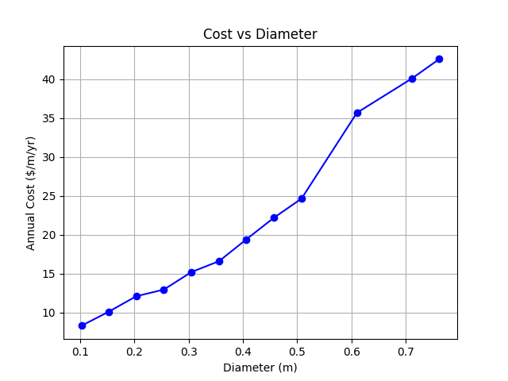

## DECISION VARIABLES

Decision variables are diameters $x_i$ for each pipe with index $i$.

The objective is to minimize the total cost of the pipes while satisfying certain constraints. We also implement the removal of some pipes from the network. Those pipes that are redundant are removed from the network while maintaining the desired constraints.

To achieve this we set diameter sizes in these boundaries:

$$lowerBound<=x_i<= upperBound $$ 

The variable ```upperBound``` is set according to the used network (we use 0.762), but the lower bound is set to ```0``` (WITH THIS WE ACHIEVE TOTAL REMOVAL OF SOME PIPES). We remove those pipes whose diameter is smaller than ```0.1```:

$$x_i <= X_{min}$$

where $X_{min} = 0.1$.

## CONSTRAINTS

We have implicit and explicit constraints.

### Implicit constraints:

Implicit system constraints are Conservation of mass and Conservation of energy. They are maintained through the EPANET simulator and because of that they are called implicit constraints.

### Explicit constraints:

Explicit constraints are given and handled by us through our optimization process. The explicit constraints that we use are:

* Pressure demand constraint
* Pipe criticality constraint (Network resilience)
* Network connectivity

These constraints are handled by penalizing the objective function.

If there are some isolated nodes the network doesn't function properly, so we also introduce a <b>Network connectivity penalty</b> for penalizing those solutions that lead to isolated nodes. The network connectivity penalty is set to a high value so that our simulation quickly abandons such solutions.

### PRESSURE CONSTRAINT:

We want to maintain junction pressure levels above minimum pressure for that junction. To obtain minimum pressures we run a simulation before optimization and obtain minimum junction pressures for each node. 

$P_{node} >= P_{min}$.

This is maintained using a penalty function on a minimization objective.

$P_{pressure} = \sum_{node} max(0, P_{min}-P_{node})$

### PIPE CRITICALITY CONSTRAINT:

We perform criticality analysis by doing <b>n+1</b> simulations where we turn off one pipe at a time and calculate a number of impacted junctions by that closure. Finally, we find the total number of impacted junctions and create a penalty function for our cost function. We set a threshold for junctions impacted as maxJunctions, and simJunctions as a total number of impacted junctions. We want to maintain the number of impacted junctions affected through pipe criticality analysis.

$P_{junction} = max(0, maxJunctions - simJunctions)$

Closing some pipes can lead to incorrect operation of the simulation (wntr simulation cannot converge, consumers' needs cannot be met). We solved that problem with try catch blocks on simulation calls, which catch errors and warnings for each simulation but enables simulation to continue.

### FINAL OBJECTIVE FUNCTION

$$MIN f(x) = \sum_{i=1}^{n} Cost(x_i)\cdot l_i +P_{pressure}+P_{junction} + P_{connectivity}$$

## CODE STRUCTURE

networks -> holds INP files of networks (We used Modified 19 Pipes Network, Fourteen Pipes Network and Anytown Network). Here are also saved final INP files from optimization process.

main.py -> starting point of our program, where we define thresholds, print starting values of cost, pressures, diameters and call criticality analysis. Call optimization and then print final values, draw network and perform final criticality analysis.

network.py -> all wntr helper functions that we use, like file include, simulation run, pressure extractions, cost calculation, diameters update, plotting and etc.

criticality.py -> criticality analysis of a network. In this file we obtain a number of impacted junctions and if needed plot criticality analysis.

optimization.py -> definition of optimization algorithm and proces, and definition of an objective function (uses <b>pymoo</b> library for optimization).

## EXAMPLES

### NETWORK 1 - MODIFIED 19 PIPES NETWORK - WITHOUT CRITICALITY ANALYSIS

Cost and layout optimization of a 19 pipes network (https://uknowledge.uky.edu/wdst_systems/7/).

The network with it's pressures is shown in Figure 2.

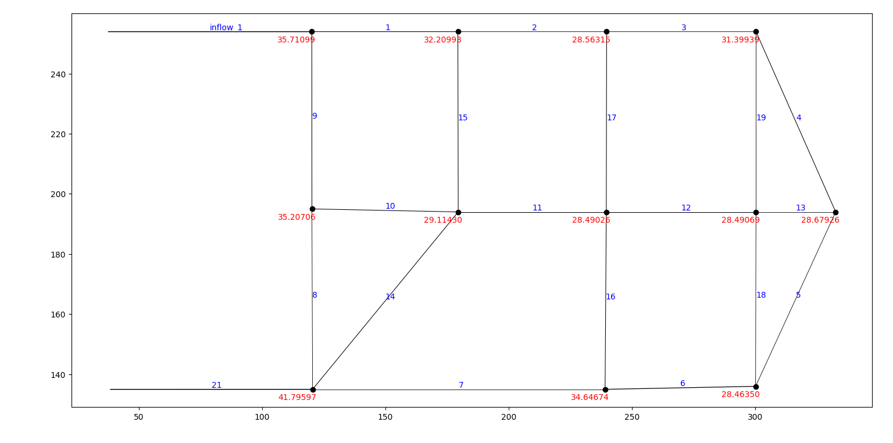

Initial cost is: <b>134505.192</b>

We want to minimize the cost, remove redundant pipes while maintaining pressures from the Figure 2. We are using GA with a population of 20 and 400 generations. 

```
####Program starts####
####Initial readings####
Initial pipe cost:  134505.192
Initial Pipe Diameters:
1           0.2540
2           0.2032
3           0.2032
4           0.2540
5           0.2032
6           0.3048
7           0.2032
8           0.2032
9           0.2540
10          0.2540
11          0.2540
12          0.2540
13          0.2032
14          0.2540
15          0.2540
16          0.2540
17          0.2540
18          0.2032
19          0.2032
inflow_1    0.3556
21          0.3556
dtype: float64
####Initial simulation starting####
Initial minimum pressures for nodes
1     35.710976
2     32.209911
3     28.563131
4     31.399393
5     28.679264
6     28.463499
7     34.646744
8     41.795975
9     35.207039
10    29.114273
11    28.490177
12    28.490692
dtype: float64
Starting list of pressures for whole network:
name            1          2          3  ...         12  R-A  R-B
0       35.710991  32.209930  28.563152  ...  28.490692  0.0  0.0
3600    35.710976  32.209911  28.563131  ...  28.490875  0.0  0.0
7200    35.710976  32.209911  28.563131  ...  28.490875  0.0  0.0
10800   35.710976  32.209911  28.563131  ...  28.490875  0.0  0.0
14400   35.710976  32.209911  28.563131  ...  28.490875  0.0  0.0
...           ...        ...        ...  ...        ...  ...  ...
590400  35.710976  32.209911  28.563131  ...  28.490875  0.0  0.0
594000  35.710976  32.209911  28.563131  ...  28.490875  0.0  0.0
597600  35.710976  32.209911  28.563131  ...  28.490875  0.0  0.0
601200  35.710976  32.209911  28.563131  ...  28.490875  0.0  0.0
604800  35.710976  32.209911  28.563131  ...  28.490875  0.0  0.0

[169 rows x 14 columns]
Starting list of Junction(consumers) pressures:
name            1          2          3  ...         10         11         12
0       35.710991  32.209930  28.563152  ...  29.114296  28.490261  28.490692
3600    35.710976  32.209911  28.563131  ...  29.114273  28.490177  28.490875
7200    35.710976  32.209911  28.563131  ...  29.114273  28.490177  28.490875
10800   35.710976  32.209911  28.563131  ...  29.114273  28.490177  28.490875
14400   35.710976  32.209911  28.563131  ...  29.114273  28.490177  28.490875
...           ...        ...        ...  ...        ...        ...        ...
590400  35.710976  32.209911  28.563131  ...  29.114273  28.490177  28.490875
594000  35.710976  32.209911  28.563131  ...  29.114273  28.490177  28.490875
597600  35.710976  32.209911  28.563131  ...  29.114273  28.490177  28.490875
601200  35.710976  32.209911  28.563131  ...  29.114273  28.490177  28.490875
604800  35.710976  32.209911  28.563131  ...  29.114273  28.490177  28.490875

[169 rows x 12 columns]
Maximum pressure:  41.795982
Minimum pressure:  28.4635
name            1          2          3  ...         10         11         12
0       35.710991  32.209930  28.563152  ...  29.114296  28.490261  28.490692
3600    35.710976  32.209911  28.563131  ...  29.114273  28.490177  28.490875
7200    35.710976  32.209911  28.563131  ...  29.114273  28.490177  28.490875
10800   35.710976  32.209911  28.563131  ...  29.114273  28.490177  28.490875
14400   35.710976  32.209911  28.563131  ...  29.114273  28.490177  28.490875
...           ...        ...        ...  ...        ...        ...        ...
590400  35.710976  32.209911  28.563131  ...  29.114273  28.490177  28.490875
594000  35.710976  32.209911  28.563131  ...  29.114273  28.490177  28.490875
597600  35.710976  32.209911  28.563131  ...  29.114273  28.490177  28.490875
601200  35.710976  32.209911  28.563131  ...  29.114273  28.490177  28.490875
604800  35.710976  32.209911  28.563131  ...  29.114273  28.490177  28.490875

[169 rows x 12 columns]
####Starting optimization####
=================================================================================
n_gen  |  n_eval  |     cv_min    |     cv_avg    |     f_avg     |     f_min    
=================================================================================
     1 |       20 |  0.000000E+00 |  2.986912E+01 |  2.366354E+05 |  2.112477E+05
     2 |       40 |  0.000000E+00 |  0.000000E+00 |  2.299401E+05 |  1.824825E+05
     3 |       60 |  0.000000E+00 |  0.000000E+00 |  2.120199E+05 |  1.663233E+05
     4 |       80 |  0.000000E+00 |  0.000000E+00 |  1.973257E+05 |  1.663233E+05
     5 |      100 |  0.000000E+00 |  0.000000E+00 |  1.816628E+05 |  1.543416E+05
     6 |      120 |  0.000000E+00 |  0.000000E+00 |  1.687280E+05 |  1.543416E+05
     7 |      140 |  0.000000E+00 |  0.000000E+00 |  1.602138E+05 |  1.500914E+05
     8 |      160 |  0.000000E+00 |  0.000000E+00 |  1.548444E+05 |  1.476405E+05
     9 |      180 |  0.000000E+00 |  0.000000E+00 |  1.508644E+05 |  1.443633E+05
    10 |      200 |  0.000000E+00 |  0.000000E+00 |  1.465009E+05 |  1.373532E+05
    11 |      220 |  0.000000E+00 |  0.000000E+00 |  1.424052E+05 |  1.363200E+05
    12 |      240 |  0.000000E+00 |  0.000000E+00 |  1.379208E+05 |  1.335938E+05
    13 |      260 |  0.000000E+00 |  0.000000E+00 |  1.362555E+05 |  1.328943E+05
    14 |      280 |  0.000000E+00 |  0.000000E+00 |  1.334745E+05 |  1.229908E+05
    15 |      300 |  0.000000E+00 |  0.000000E+00 |  1.295768E+05 |  1.227024E+05
    16 |      320 |  0.000000E+00 |  0.000000E+00 |  1.255788E+05 |  1.175333E+05
    17 |      340 |  0.000000E+00 |  0.000000E+00 |  1.220814E+05 |  1.156259E+05
    18 |      360 |  0.000000E+00 |  0.000000E+00 |  1.198116E+05 |  1.156259E+05
    19 |      380 |  0.000000E+00 |  0.000000E+00 |  1.173620E+05 |  1.151992E+05
    20 |      400 |  0.000000E+00 |  0.000000E+00 |  1.161007E+05 |  1.150529E+05
    21 |      420 |  0.000000E+00 |  0.000000E+00 |  1.149369E+05 |  1.114206E+05
    22 |      440 |  0.000000E+00 |  0.000000E+00 |  1.138109E+05 |  1.092931E+05
    23 |      460 |  0.000000E+00 |  0.000000E+00 |  1.117272E+05 |  1.092931E+05
    24 |      480 |  0.000000E+00 |  0.000000E+00 |  1.100148E+05 |  1.089529E+05
    25 |      500 |  0.000000E+00 |  0.000000E+00 |  1.092295E+05 |  1.085615E+05
    26 |      520 |  0.000000E+00 |  0.000000E+00 |  1.088881E+05 |  1.081775E+05
    27 |      540 |  0.000000E+00 |  0.000000E+00 |  1.085407E+05 |  1.067913E+05
    28 |      560 |  0.000000E+00 |  0.000000E+00 |  1.079644E+05 |  1.057708E+05
    29 |      580 |  0.000000E+00 |  0.000000E+00 |  1.071584E+05 |  1.036463E+05
    30 |      600 |  0.000000E+00 |  0.000000E+00 |  1.064141E+05 |  1.036463E+05
    31 |      620 |  0.000000E+00 |  0.000000E+00 |  1.057056E+05 |  1.036463E+05
    32 |      640 |  0.000000E+00 |  0.000000E+00 |  1.051497E+05 |  1.028115E+05
    33 |      660 |  0.000000E+00 |  0.000000E+00 |  1.042648E+05 |  1.010235E+05
    34 |      680 |  0.000000E+00 |  0.000000E+00 |  1.029585E+05 |  9.977201E+04
    35 |      700 |  0.000000E+00 |  0.000000E+00 |  1.015717E+05 |  9.971654E+04
    36 |      720 |  0.000000E+00 |  0.000000E+00 |  1.004581E+05 |  9.875154E+04
    37 |      740 |  0.000000E+00 |  0.000000E+00 |  9.983722E+04 |  9.875154E+04
    38 |      760 |  0.000000E+00 |  0.000000E+00 |  9.924370E+04 |  9.752259E+04
    39 |      780 |  0.000000E+00 |  0.000000E+00 |  9.875849E+04 |  9.650212E+04
    40 |      800 |  0.000000E+00 |  0.000000E+00 |  9.839121E+04 |  9.650212E+04
    41 |      820 |  0.000000E+00 |  0.000000E+00 |  9.744679E+04 |  9.548165E+04
    42 |      840 |  0.000000E+00 |  0.000000E+00 |  9.640874E+04 |  9.523141E+04
    43 |      860 |  0.000000E+00 |  0.000000E+00 |  9.614931E+04 |  9.523141E+04
    44 |      880 |  0.000000E+00 |  0.000000E+00 |  9.591131E+04 |  9.523141E+04
    45 |      900 |  0.000000E+00 |  0.000000E+00 |  9.527950E+04 |  9.421094E+04
    46 |      920 |  0.000000E+00 |  0.000000E+00 |  9.498821E+04 |  9.421094E+04
    47 |      940 |  0.000000E+00 |  0.000000E+00 |  9.469929E+04 |  9.394881E+04
    48 |      960 |  0.000000E+00 |  0.000000E+00 |  9.422767E+04 |  9.326850E+04
    49 |      980 |  0.000000E+00 |  0.000000E+00 |  9.402742E+04 |  9.311975E+04
    50 |     1000 |  0.000000E+00 |  0.000000E+00 |  9.377663E+04 |  9.311975E+04
    51 |     1020 |  0.000000E+00 |  0.000000E+00 |  9.320333E+04 |  9.224802E+04
    52 |     1040 |  0.000000E+00 |  0.000000E+00 |  9.290923E+04 |  9.141897E+04
    53 |     1060 |  0.000000E+00 |  0.000000E+00 |  9.258756E+04 |  9.115684E+04
    54 |     1080 |  0.000000E+00 |  0.000000E+00 |  9.206984E+04 |  9.115684E+04
    55 |     1100 |  0.000000E+00 |  0.000000E+00 |  9.156465E+04 |  9.115684E+04
    56 |     1120 |  0.000000E+00 |  0.000000E+00 |  9.125726E+04 |  9.099225E+04
    57 |     1140 |  0.000000E+00 |  0.000000E+00 |  9.111905E+04 |  9.073012E+04
    58 |     1160 |  0.000000E+00 |  0.000000E+00 |  9.105991E+04 |  9.073012E+04
    59 |     1180 |  0.000000E+00 |  0.000000E+00 |  9.093678E+04 |  9.073012E+04
    60 |     1200 |  0.000000E+00 |  0.000000E+00 |  9.080876E+04 |  9.073012E+04
    61 |     1220 |  0.000000E+00 |  0.000000E+00 |  9.073012E+04 |  9.073012E+04
    62 |     1240 |  0.000000E+00 |  0.000000E+00 |  9.073012E+04 |  9.073012E+04
    63 |     1260 |  0.000000E+00 |  0.000000E+00 |  9.073012E+04 |  9.073012E+04
    64 |     1280 |  0.000000E+00 |  0.000000E+00 |  9.067346E+04 |  8.959687E+04
    65 |     1300 |  0.000000E+00 |  0.000000E+00 |  9.046903E+04 |  8.959687E+04
    66 |     1320 |  0.000000E+00 |  0.000000E+00 |  8.999907E+04 |  8.890803E+04
    67 |     1340 |  0.000000E+00 |  0.000000E+00 |  8.945910E+04 |  8.890803E+04
    68 |     1360 |  0.000000E+00 |  0.000000E+00 |  8.928689E+04 |  8.890803E+04
    69 |     1380 |  0.000000E+00 |  0.000000E+00 |  8.890701E+04 |  8.819876E+04
    70 |     1400 |  0.000000E+00 |  0.000000E+00 |  8.876293E+04 |  8.813383E+04
    71 |     1420 |  0.000000E+00 |  0.000000E+00 |  8.850819E+04 |  8.813383E+04
    72 |     1440 |  0.000000E+00 |  0.000000E+00 |  8.809586E+04 |  8.742456E+04
    73 |     1460 |  0.000000E+00 |  0.000000E+00 |  8.802697E+04 |  8.742456E+04
    74 |     1480 |  0.000000E+00 |  0.000000E+00 |  8.788260E+04 |  8.742456E+04
    75 |     1500 |  0.000000E+00 |  0.000000E+00 |  8.755362E+04 |  8.659795E+04
    76 |     1520 |  0.000000E+00 |  0.000000E+00 |  8.736385E+04 |  8.659795E+04
    77 |     1540 |  0.000000E+00 |  0.000000E+00 |  8.721139E+04 |  8.659795E+04
    78 |     1560 |  0.000000E+00 |  0.000000E+00 |  8.681707E+04 |  8.598835E+04
    79 |     1580 |  0.000000E+00 |  0.000000E+00 |  8.652739E+04 |  8.574756E+04
    80 |     1600 |  0.000000E+00 |  0.000000E+00 |  8.634051E+04 |  8.574756E+04
    81 |     1620 |  0.000000E+00 |  0.000000E+00 |  8.599423E+04 |  8.428756E+04
    82 |     1640 |  0.000000E+00 |  0.000000E+00 |  8.574768E+04 |  8.428756E+04
    83 |     1660 |  0.000000E+00 |  0.000000E+00 |  8.535831E+04 |  8.418698E+04
    84 |     1680 |  0.000000E+00 |  0.000000E+00 |  8.491996E+04 |  8.409219E+04
    85 |     1700 |  0.000000E+00 |  0.000000E+00 |  8.439860E+04 |  8.343717E+04
    86 |     1720 |  0.000000E+00 |  0.000000E+00 |  8.413420E+04 |  8.343717E+04
    87 |     1740 |  0.000000E+00 |  0.000000E+00 |  8.387130E+04 |  8.288244E+04
    88 |     1760 |  0.000000E+00 |  0.000000E+00 |  8.356394E+04 |  8.288244E+04
    89 |     1780 |  0.000000E+00 |  0.000000E+00 |  8.334768E+04 |  8.275686E+04
    90 |     1800 |  0.000000E+00 |  0.000000E+00 |  8.320272E+04 |  8.275686E+04
    91 |     1820 |  0.000000E+00 |  0.000000E+00 |  8.287923E+04 |  8.220212E+04
    92 |     1840 |  0.000000E+00 |  0.000000E+00 |  8.253783E+04 |  8.165653E+04
    93 |     1860 |  0.000000E+00 |  0.000000E+00 |  8.220999E+04 |  8.165653E+04
    94 |     1880 |  0.000000E+00 |  0.000000E+00 |  8.188681E+04 |  8.165653E+04
    95 |     1900 |  0.000000E+00 |  0.000000E+00 |  8.166964E+04 |  8.165653E+04
    96 |     1920 |  0.000000E+00 |  0.000000E+00 |  8.161175E+04 |  8.076103E+04
    97 |     1940 |  0.000000E+00 |  0.000000E+00 |  8.152220E+04 |  8.076103E+04
    98 |     1960 |  0.000000E+00 |  0.000000E+00 |  8.143265E+04 |  8.076103E+04
    99 |     1980 |  0.000000E+00 |  0.000000E+00 |  8.111923E+04 |  8.076103E+04
   100 |     2000 |  0.000000E+00 |  0.000000E+00 |  8.076103E+04 |  8.076103E+04
   101 |     2020 |  0.000000E+00 |  0.000000E+00 |  8.076103E+04 |  8.076103E+04
   102 |     2040 |  0.000000E+00 |  0.000000E+00 |  8.076103E+04 |  8.076103E+04
   103 |     2060 |  0.000000E+00 |  0.000000E+00 |  8.076103E+04 |  8.076103E+04
   104 |     2080 |  0.000000E+00 |  0.000000E+00 |  8.076103E+04 |  8.076103E+04
   105 |     2100 |  0.000000E+00 |  0.000000E+00 |  8.076103E+04 |  8.076103E+04
   106 |     2120 |  0.000000E+00 |  0.000000E+00 |  8.076103E+04 |  8.076103E+04
   107 |     2140 |  0.000000E+00 |  0.000000E+00 |  8.076103E+04 |  8.076103E+04
   108 |     2160 |  0.000000E+00 |  0.000000E+00 |  8.076103E+04 |  8.076103E+04
   109 |     2180 |  0.000000E+00 |  0.000000E+00 |  8.076103E+04 |  8.076103E+04
   110 |     2200 |  0.000000E+00 |  0.000000E+00 |  8.076103E+04 |  8.076103E+04
   111 |     2220 |  0.000000E+00 |  0.000000E+00 |  8.076103E+04 |  8.076103E+04
   112 |     2240 |  0.000000E+00 |  0.000000E+00 |  8.076103E+04 |  8.076103E+04
   113 |     2260 |  0.000000E+00 |  0.000000E+00 |  8.076103E+04 |  8.076103E+04
   114 |     2280 |  0.000000E+00 |  0.000000E+00 |  8.076103E+04 |  8.076103E+04
   115 |     2300 |  0.000000E+00 |  0.000000E+00 |  8.076103E+04 |  8.076103E+04
   116 |     2320 |  0.000000E+00 |  0.000000E+00 |  8.076103E+04 |  8.076103E+04
   117 |     2340 |  0.000000E+00 |  0.000000E+00 |  8.076103E+04 |  8.076103E+04
   118 |     2360 |  0.000000E+00 |  0.000000E+00 |  8.076103E+04 |  8.076103E+04
   119 |     2380 |  0.000000E+00 |  0.000000E+00 |  8.076103E+04 |  8.076103E+04
   120 |     2400 |  0.000000E+00 |  0.000000E+00 |  8.076103E+04 |  8.076103E+04
   121 |     2420 |  0.000000E+00 |  0.000000E+00 |  8.076103E+04 |  8.076103E+04
   122 |     2440 |  0.000000E+00 |  0.000000E+00 |  8.076103E+04 |  8.076103E+04
   123 |     2460 |  0.000000E+00 |  0.000000E+00 |  8.076103E+04 |  8.076103E+04
   124 |     2480 |  0.000000E+00 |  0.000000E+00 |  8.076103E+04 |  8.076103E+04
   125 |     2500 |  0.000000E+00 |  0.000000E+00 |  8.076103E+04 |  8.076103E+04
   126 |     2520 |  0.000000E+00 |  0.000000E+00 |  8.076103E+04 |  8.076103E+04
   127 |     2540 |  0.000000E+00 |  0.000000E+00 |  8.076103E+04 |  8.076103E+04
   128 |     2560 |  0.000000E+00 |  0.000000E+00 |  8.076103E+04 |  8.076103E+04
   129 |     2580 |  0.000000E+00 |  0.000000E+00 |  8.076103E+04 |  8.076103E+04
   130 |     2600 |  0.000000E+00 |  0.000000E+00 |  8.076103E+04 |  8.076103E+04
   131 |     2620 |  0.000000E+00 |  0.000000E+00 |  8.076103E+04 |  8.076103E+04
   132 |     2640 |  0.000000E+00 |  0.000000E+00 |  8.076103E+04 |  8.076103E+04
   133 |     2660 |  0.000000E+00 |  0.000000E+00 |  8.076103E+04 |  8.076103E+04
   134 |     2680 |  0.000000E+00 |  0.000000E+00 |  8.076103E+04 |  8.076103E+04
   135 |     2700 |  0.000000E+00 |  0.000000E+00 |  8.076103E+04 |  8.076103E+04
   136 |     2720 |  0.000000E+00 |  0.000000E+00 |  8.076103E+04 |  8.076103E+04
   137 |     2740 |  0.000000E+00 |  0.000000E+00 |  8.076103E+04 |  8.076103E+04
   138 |     2760 |  0.000000E+00 |  0.000000E+00 |  8.076103E+04 |  8.076103E+04
   139 |     2780 |  0.000000E+00 |  0.000000E+00 |  8.076103E+04 |  8.076103E+04
   140 |     2800 |  0.000000E+00 |  0.000000E+00 |  8.076103E+04 |  8.076103E+04
   141 |     2820 |  0.000000E+00 |  0.000000E+00 |  8.076103E+04 |  8.076103E+04
   142 |     2840 |  0.000000E+00 |  0.000000E+00 |  8.076103E+04 |  8.076103E+04
   143 |     2860 |  0.000000E+00 |  0.000000E+00 |  8.076103E+04 |  8.076103E+04
   144 |     2880 |  0.000000E+00 |  0.000000E+00 |  8.076103E+04 |  8.076103E+04
   145 |     2900 |  0.000000E+00 |  0.000000E+00 |  8.076103E+04 |  8.076103E+04
   146 |     2920 |  0.000000E+00 |  0.000000E+00 |  8.076103E+04 |  8.076103E+04
   147 |     2940 |  0.000000E+00 |  0.000000E+00 |  8.076103E+04 |  8.076103E+04
   148 |     2960 |  0.000000E+00 |  0.000000E+00 |  8.076103E+04 |  8.076103E+04
   149 |     2980 |  0.000000E+00 |  0.000000E+00 |  8.076103E+04 |  8.076103E+04
   150 |     3000 |  0.000000E+00 |  0.000000E+00 |  8.076103E+04 |  8.076103E+04
   151 |     3020 |  0.000000E+00 |  0.000000E+00 |  8.076103E+04 |  8.076103E+04
   152 |     3040 |  0.000000E+00 |  0.000000E+00 |  8.076103E+04 |  8.076103E+04
   153 |     3060 |  0.000000E+00 |  0.000000E+00 |  8.076103E+04 |  8.076103E+04
   154 |     3080 |  0.000000E+00 |  0.000000E+00 |  8.076103E+04 |  8.076103E+04
   155 |     3100 |  0.000000E+00 |  0.000000E+00 |  8.076103E+04 |  8.076103E+04
   156 |     3120 |  0.000000E+00 |  0.000000E+00 |  8.076103E+04 |  8.076103E+04
   157 |     3140 |  0.000000E+00 |  0.000000E+00 |  8.076103E+04 |  8.076103E+04
   158 |     3160 |  0.000000E+00 |  0.000000E+00 |  8.076103E+04 |  8.076103E+04
   159 |     3180 |  0.000000E+00 |  0.000000E+00 |  8.076103E+04 |  8.076103E+04
   160 |     3200 |  0.000000E+00 |  0.000000E+00 |  8.076103E+04 |  8.076103E+04
   161 |     3220 |  0.000000E+00 |  0.000000E+00 |  8.076103E+04 |  8.076103E+04
   162 |     3240 |  0.000000E+00 |  0.000000E+00 |  8.076103E+04 |  8.076103E+04
   163 |     3260 |  0.000000E+00 |  0.000000E+00 |  8.076103E+04 |  8.076103E+04
   164 |     3280 |  0.000000E+00 |  0.000000E+00 |  8.076103E+04 |  8.076103E+04
   165 |     3300 |  0.000000E+00 |  0.000000E+00 |  8.076103E+04 |  8.076103E+04
   166 |     3320 |  0.000000E+00 |  0.000000E+00 |  8.076103E+04 |  8.076103E+04
   167 |     3340 |  0.000000E+00 |  0.000000E+00 |  8.076103E+04 |  8.076103E+04
   168 |     3360 |  0.000000E+00 |  0.000000E+00 |  8.076103E+04 |  8.076103E+04
   169 |     3380 |  0.000000E+00 |  0.000000E+00 |  8.076103E+04 |  8.076103E+04
   170 |     3400 |  0.000000E+00 |  0.000000E+00 |  8.076103E+04 |  8.076103E+04
   171 |     3420 |  0.000000E+00 |  0.000000E+00 |  8.076103E+04 |  8.076103E+04
   172 |     3440 |  0.000000E+00 |  0.000000E+00 |  8.076103E+04 |  8.076103E+04
   173 |     3460 |  0.000000E+00 |  0.000000E+00 |  8.076103E+04 |  8.076103E+04
   174 |     3480 |  0.000000E+00 |  0.000000E+00 |  8.076103E+04 |  8.076103E+04
   175 |     3500 |  0.000000E+00 |  0.000000E+00 |  8.076103E+04 |  8.076103E+04
   176 |     3520 |  0.000000E+00 |  0.000000E+00 |  8.076103E+04 |  8.076103E+04
   177 |     3540 |  0.000000E+00 |  0.000000E+00 |  8.076103E+04 |  8.076103E+04
   178 |     3560 |  0.000000E+00 |  0.000000E+00 |  8.076103E+04 |  8.076103E+04
   179 |     3580 |  0.000000E+00 |  0.000000E+00 |  8.076103E+04 |  8.076103E+04
   180 |     3600 |  0.000000E+00 |  0.000000E+00 |  8.076103E+04 |  8.076103E+04
   181 |     3620 |  0.000000E+00 |  0.000000E+00 |  8.076103E+04 |  8.076103E+04
   182 |     3640 |  0.000000E+00 |  0.000000E+00 |  8.076103E+04 |  8.076103E+04
   183 |     3660 |  0.000000E+00 |  0.000000E+00 |  8.076103E+04 |  8.076103E+04
   184 |     3680 |  0.000000E+00 |  0.000000E+00 |  8.076103E+04 |  8.076103E+04
   185 |     3700 |  0.000000E+00 |  0.000000E+00 |  8.076103E+04 |  8.076103E+04
   186 |     3720 |  0.000000E+00 |  0.000000E+00 |  8.076103E+04 |  8.076103E+04
   187 |     3740 |  0.000000E+00 |  0.000000E+00 |  8.076103E+04 |  8.076103E+04
   188 |     3760 |  0.000000E+00 |  0.000000E+00 |  8.076103E+04 |  8.076103E+04
   189 |     3780 |  0.000000E+00 |  0.000000E+00 |  8.076103E+04 |  8.076103E+04
   190 |     3800 |  0.000000E+00 |  0.000000E+00 |  8.076103E+04 |  8.076103E+04
   191 |     3820 |  0.000000E+00 |  0.000000E+00 |  8.076103E+04 |  8.076103E+04
   192 |     3840 |  0.000000E+00 |  0.000000E+00 |  8.076103E+04 |  8.076103E+04
   193 |     3860 |  0.000000E+00 |  0.000000E+00 |  8.076103E+04 |  8.076103E+04
   194 |     3880 |  0.000000E+00 |  0.000000E+00 |  8.076103E+04 |  8.076103E+04
   195 |     3900 |  0.000000E+00 |  0.000000E+00 |  8.076103E+04 |  8.076103E+04
   196 |     3920 |  0.000000E+00 |  0.000000E+00 |  8.076103E+04 |  8.076103E+04
   197 |     3940 |  0.000000E+00 |  0.000000E+00 |  8.076103E+04 |  8.076103E+04
   198 |     3960 |  0.000000E+00 |  0.000000E+00 |  8.076103E+04 |  8.076103E+04
   199 |     3980 |  0.000000E+00 |  0.000000E+00 |  8.076103E+04 |  8.076103E+04
   200 |     4000 |  0.000000E+00 |  0.000000E+00 |  8.076103E+04 |  8.076103E+04
   201 |     4020 |  0.000000E+00 |  0.000000E+00 |  8.076103E+04 |  8.076103E+04
   202 |     4040 |  0.000000E+00 |  0.000000E+00 |  8.076103E+04 |  8.076103E+04
   203 |     4060 |  0.000000E+00 |  0.000000E+00 |  8.076103E+04 |  8.076103E+04
   204 |     4080 |  0.000000E+00 |  0.000000E+00 |  8.076103E+04 |  8.076103E+04
   205 |     4100 |  0.000000E+00 |  0.000000E+00 |  8.076103E+04 |  8.076103E+04
   206 |     4120 |  0.000000E+00 |  0.000000E+00 |  8.076103E+04 |  8.076103E+04
   207 |     4140 |  0.000000E+00 |  0.000000E+00 |  8.076103E+04 |  8.076103E+04
   208 |     4160 |  0.000000E+00 |  0.000000E+00 |  8.076103E+04 |  8.076103E+04
   209 |     4180 |  0.000000E+00 |  0.000000E+00 |  8.076103E+04 |  8.076103E+04
   210 |     4200 |  0.000000E+00 |  0.000000E+00 |  8.076103E+04 |  8.076103E+04
   211 |     4220 |  0.000000E+00 |  0.000000E+00 |  8.076103E+04 |  8.076103E+04
   212 |     4240 |  0.000000E+00 |  0.000000E+00 |  8.076103E+04 |  8.076103E+04
   213 |     4260 |  0.000000E+00 |  0.000000E+00 |  8.076103E+04 |  8.076103E+04
   214 |     4280 |  0.000000E+00 |  0.000000E+00 |  8.076103E+04 |  8.076103E+04
   215 |     4300 |  0.000000E+00 |  0.000000E+00 |  8.076103E+04 |  8.076103E+04
   216 |     4320 |  0.000000E+00 |  0.000000E+00 |  8.076103E+04 |  8.076103E+04
   217 |     4340 |  0.000000E+00 |  0.000000E+00 |  8.076103E+04 |  8.076103E+04
   218 |     4360 |  0.000000E+00 |  0.000000E+00 |  8.076103E+04 |  8.076103E+04
   219 |     4380 |  0.000000E+00 |  0.000000E+00 |  8.076103E+04 |  8.076103E+04
   220 |     4400 |  0.000000E+00 |  0.000000E+00 |  8.076103E+04 |  8.076103E+04
   221 |     4420 |  0.000000E+00 |  0.000000E+00 |  8.076103E+04 |  8.076103E+04
   222 |     4440 |  0.000000E+00 |  0.000000E+00 |  8.076103E+04 |  8.076103E+04
   223 |     4460 |  0.000000E+00 |  0.000000E+00 |  8.076103E+04 |  8.076103E+04
   224 |     4480 |  0.000000E+00 |  0.000000E+00 |  8.076103E+04 |  8.076103E+04
   225 |     4500 |  0.000000E+00 |  0.000000E+00 |  8.076103E+04 |  8.076103E+04
   226 |     4520 |  0.000000E+00 |  0.000000E+00 |  8.076103E+04 |  8.076103E+04
   227 |     4540 |  0.000000E+00 |  0.000000E+00 |  8.076103E+04 |  8.076103E+04
   228 |     4560 |  0.000000E+00 |  0.000000E+00 |  8.076103E+04 |  8.076103E+04
   229 |     4580 |  0.000000E+00 |  0.000000E+00 |  8.076103E+04 |  8.076103E+04
   230 |     4600 |  0.000000E+00 |  0.000000E+00 |  8.076103E+04 |  8.076103E+04
   231 |     4620 |  0.000000E+00 |  0.000000E+00 |  8.076103E+04 |  8.076103E+04
   232 |     4640 |  0.000000E+00 |  0.000000E+00 |  8.076103E+04 |  8.076103E+04
   233 |     4660 |  0.000000E+00 |  0.000000E+00 |  8.076103E+04 |  8.076103E+04
   234 |     4680 |  0.000000E+00 |  0.000000E+00 |  8.076103E+04 |  8.076103E+04
   235 |     4700 |  0.000000E+00 |  0.000000E+00 |  8.076103E+04 |  8.076103E+04
   236 |     4720 |  0.000000E+00 |  0.000000E+00 |  8.076103E+04 |  8.076103E+04
   237 |     4740 |  0.000000E+00 |  0.000000E+00 |  8.076103E+04 |  8.076103E+04
   238 |     4760 |  0.000000E+00 |  0.000000E+00 |  8.076103E+04 |  8.076103E+04
   239 |     4780 |  0.000000E+00 |  0.000000E+00 |  8.076103E+04 |  8.076103E+04
   240 |     4800 |  0.000000E+00 |  0.000000E+00 |  8.076103E+04 |  8.076103E+04
   241 |     4820 |  0.000000E+00 |  0.000000E+00 |  8.076103E+04 |  8.076103E+04
   242 |     4840 |  0.000000E+00 |  0.000000E+00 |  8.076103E+04 |  8.076103E+04
   243 |     4860 |  0.000000E+00 |  0.000000E+00 |  8.076103E+04 |  8.076103E+04
   244 |     4880 |  0.000000E+00 |  0.000000E+00 |  8.076103E+04 |  8.076103E+04
   245 |     4900 |  0.000000E+00 |  0.000000E+00 |  8.076103E+04 |  8.076103E+04
   246 |     4920 |  0.000000E+00 |  0.000000E+00 |  8.076103E+04 |  8.076103E+04
   247 |     4940 |  0.000000E+00 |  0.000000E+00 |  8.076103E+04 |  8.076103E+04
   248 |     4960 |  0.000000E+00 |  0.000000E+00 |  8.076103E+04 |  8.076103E+04
   249 |     4980 |  0.000000E+00 |  0.000000E+00 |  8.076103E+04 |  8.076103E+04
   250 |     5000 |  0.000000E+00 |  0.000000E+00 |  8.076103E+04 |  8.076103E+04
   251 |     5020 |  0.000000E+00 |  0.000000E+00 |  8.076103E+04 |  8.076103E+04
   252 |     5040 |  0.000000E+00 |  0.000000E+00 |  8.076103E+04 |  8.076103E+04
   253 |     5060 |  0.000000E+00 |  0.000000E+00 |  8.076103E+04 |  8.076103E+04
   254 |     5080 |  0.000000E+00 |  0.000000E+00 |  8.076103E+04 |  8.076103E+04
   255 |     5100 |  0.000000E+00 |  0.000000E+00 |  8.076103E+04 |  8.076103E+04
   256 |     5120 |  0.000000E+00 |  0.000000E+00 |  8.076103E+04 |  8.076103E+04
   257 |     5140 |  0.000000E+00 |  0.000000E+00 |  8.076103E+04 |  8.076103E+04
   258 |     5160 |  0.000000E+00 |  0.000000E+00 |  8.076103E+04 |  8.076103E+04
   259 |     5180 |  0.000000E+00 |  0.000000E+00 |  8.076103E+04 |  8.076103E+04
   260 |     5200 |  0.000000E+00 |  0.000000E+00 |  8.076103E+04 |  8.076103E+04
   261 |     5220 |  0.000000E+00 |  0.000000E+00 |  8.076103E+04 |  8.076103E+04
   262 |     5240 |  0.000000E+00 |  0.000000E+00 |  8.076103E+04 |  8.076103E+04
   263 |     5260 |  0.000000E+00 |  0.000000E+00 |  8.076103E+04 |  8.076103E+04
   264 |     5280 |  0.000000E+00 |  0.000000E+00 |  8.076103E+04 |  8.076103E+04
   265 |     5300 |  0.000000E+00 |  0.000000E+00 |  8.076103E+04 |  8.076103E+04
   266 |     5320 |  0.000000E+00 |  0.000000E+00 |  8.076103E+04 |  8.076103E+04
   267 |     5340 |  0.000000E+00 |  0.000000E+00 |  8.076103E+04 |  8.076103E+04
   268 |     5360 |  0.000000E+00 |  0.000000E+00 |  8.076103E+04 |  8.076103E+04
   269 |     5380 |  0.000000E+00 |  0.000000E+00 |  8.076103E+04 |  8.076103E+04
   270 |     5400 |  0.000000E+00 |  0.000000E+00 |  8.076103E+04 |  8.076103E+04
   271 |     5420 |  0.000000E+00 |  0.000000E+00 |  8.076103E+04 |  8.076103E+04
   272 |     5440 |  0.000000E+00 |  0.000000E+00 |  8.076103E+04 |  8.076103E+04
   273 |     5460 |  0.000000E+00 |  0.000000E+00 |  8.076103E+04 |  8.076103E+04
   274 |     5480 |  0.000000E+00 |  0.000000E+00 |  8.076103E+04 |  8.076103E+04
   275 |     5500 |  0.000000E+00 |  0.000000E+00 |  8.076103E+04 |  8.076103E+04
   276 |     5520 |  0.000000E+00 |  0.000000E+00 |  8.076103E+04 |  8.076103E+04
   277 |     5540 |  0.000000E+00 |  0.000000E+00 |  8.076103E+04 |  8.076103E+04
   278 |     5560 |  0.000000E+00 |  0.000000E+00 |  8.076103E+04 |  8.076103E+04
   279 |     5580 |  0.000000E+00 |  0.000000E+00 |  8.076103E+04 |  8.076103E+04
   280 |     5600 |  0.000000E+00 |  0.000000E+00 |  8.076103E+04 |  8.076103E+04
   281 |     5620 |  0.000000E+00 |  0.000000E+00 |  8.076103E+04 |  8.076103E+04
   282 |     5640 |  0.000000E+00 |  0.000000E+00 |  8.076103E+04 |  8.076103E+04
   283 |     5660 |  0.000000E+00 |  0.000000E+00 |  8.076103E+04 |  8.076103E+04
   284 |     5680 |  0.000000E+00 |  0.000000E+00 |  8.076103E+04 |  8.076103E+04
   285 |     5700 |  0.000000E+00 |  0.000000E+00 |  8.076103E+04 |  8.076103E+04
   286 |     5720 |  0.000000E+00 |  0.000000E+00 |  8.076103E+04 |  8.076103E+04
   287 |     5740 |  0.000000E+00 |  0.000000E+00 |  8.076103E+04 |  8.076103E+04
   288 |     5760 |  0.000000E+00 |  0.000000E+00 |  8.076103E+04 |  8.076103E+04
   289 |     5780 |  0.000000E+00 |  0.000000E+00 |  8.076103E+04 |  8.076103E+04
   290 |     5800 |  0.000000E+00 |  0.000000E+00 |  8.076103E+04 |  8.076103E+04
   291 |     5820 |  0.000000E+00 |  0.000000E+00 |  8.076103E+04 |  8.076103E+04
   292 |     5840 |  0.000000E+00 |  0.000000E+00 |  8.076103E+04 |  8.076103E+04
   293 |     5860 |  0.000000E+00 |  0.000000E+00 |  8.076103E+04 |  8.076103E+04
   294 |     5880 |  0.000000E+00 |  0.000000E+00 |  8.076103E+04 |  8.076103E+04
   295 |     5900 |  0.000000E+00 |  0.000000E+00 |  8.076103E+04 |  8.076103E+04
   296 |     5920 |  0.000000E+00 |  0.000000E+00 |  8.076103E+04 |  8.076103E+04
   297 |     5940 |  0.000000E+00 |  0.000000E+00 |  8.076103E+04 |  8.076103E+04
   298 |     5960 |  0.000000E+00 |  0.000000E+00 |  8.076103E+04 |  8.076103E+04
   299 |     5980 |  0.000000E+00 |  0.000000E+00 |  8.076103E+04 |  8.076103E+04
   300 |     6000 |  0.000000E+00 |  0.000000E+00 |  8.076103E+04 |  8.076103E+04
   301 |     6020 |  0.000000E+00 |  0.000000E+00 |  8.076103E+04 |  8.076103E+04
   302 |     6040 |  0.000000E+00 |  0.000000E+00 |  8.076103E+04 |  8.076103E+04
   303 |     6060 |  0.000000E+00 |  0.000000E+00 |  8.076103E+04 |  8.076103E+04
   304 |     6080 |  0.000000E+00 |  0.000000E+00 |  8.076103E+04 |  8.076103E+04
   305 |     6100 |  0.000000E+00 |  0.000000E+00 |  8.076103E+04 |  8.076103E+04
   306 |     6120 |  0.000000E+00 |  0.000000E+00 |  8.076103E+04 |  8.076103E+04
   307 |     6140 |  0.000000E+00 |  0.000000E+00 |  8.076103E+04 |  8.076103E+04
   308 |     6160 |  0.000000E+00 |  0.000000E+00 |  8.076103E+04 |  8.076103E+04
   309 |     6180 |  0.000000E+00 |  0.000000E+00 |  8.076103E+04 |  8.076103E+04
   310 |     6200 |  0.000000E+00 |  0.000000E+00 |  8.076103E+04 |  8.076103E+04
   311 |     6220 |  0.000000E+00 |  0.000000E+00 |  8.076103E+04 |  8.076103E+04
   312 |     6240 |  0.000000E+00 |  0.000000E+00 |  8.076103E+04 |  8.076103E+04
   313 |     6260 |  0.000000E+00 |  0.000000E+00 |  8.076103E+04 |  8.076103E+04
   314 |     6280 |  0.000000E+00 |  0.000000E+00 |  8.076103E+04 |  8.076103E+04
   315 |     6300 |  0.000000E+00 |  0.000000E+00 |  8.076103E+04 |  8.076103E+04
   316 |     6320 |  0.000000E+00 |  0.000000E+00 |  8.076103E+04 |  8.076103E+04
   317 |     6340 |  0.000000E+00 |  0.000000E+00 |  8.076103E+04 |  8.076103E+04
   318 |     6360 |  0.000000E+00 |  0.000000E+00 |  8.076103E+04 |  8.076103E+04
   319 |     6380 |  0.000000E+00 |  0.000000E+00 |  8.076103E+04 |  8.076103E+04
   320 |     6400 |  0.000000E+00 |  0.000000E+00 |  8.076103E+04 |  8.076103E+04
   321 |     6420 |  0.000000E+00 |  0.000000E+00 |  8.076103E+04 |  8.076103E+04
   322 |     6440 |  0.000000E+00 |  0.000000E+00 |  8.076103E+04 |  8.076103E+04
   323 |     6460 |  0.000000E+00 |  0.000000E+00 |  8.076103E+04 |  8.076103E+04
   324 |     6480 |  0.000000E+00 |  0.000000E+00 |  8.076103E+04 |  8.076103E+04
   325 |     6500 |  0.000000E+00 |  0.000000E+00 |  8.076103E+04 |  8.076103E+04
   326 |     6520 |  0.000000E+00 |  0.000000E+00 |  8.076103E+04 |  8.076103E+04
   327 |     6540 |  0.000000E+00 |  0.000000E+00 |  8.076103E+04 |  8.076103E+04
   328 |     6560 |  0.000000E+00 |  0.000000E+00 |  8.076103E+04 |  8.076103E+04
   329 |     6580 |  0.000000E+00 |  0.000000E+00 |  8.076103E+04 |  8.076103E+04
   330 |     6600 |  0.000000E+00 |  0.000000E+00 |  8.076103E+04 |  8.076103E+04
   331 |     6620 |  0.000000E+00 |  0.000000E+00 |  8.076103E+04 |  8.076103E+04
   332 |     6640 |  0.000000E+00 |  0.000000E+00 |  8.076103E+04 |  8.076103E+04
   333 |     6660 |  0.000000E+00 |  0.000000E+00 |  8.076103E+04 |  8.076103E+04
   334 |     6680 |  0.000000E+00 |  0.000000E+00 |  8.076103E+04 |  8.076103E+04
   335 |     6700 |  0.000000E+00 |  0.000000E+00 |  8.076103E+04 |  8.076103E+04
   336 |     6720 |  0.000000E+00 |  0.000000E+00 |  8.076103E+04 |  8.076103E+04
   337 |     6740 |  0.000000E+00 |  0.000000E+00 |  8.076103E+04 |  8.076103E+04
   338 |     6760 |  0.000000E+00 |  0.000000E+00 |  8.076103E+04 |  8.076103E+04
   339 |     6780 |  0.000000E+00 |  0.000000E+00 |  8.076103E+04 |  8.076103E+04
   340 |     6800 |  0.000000E+00 |  0.000000E+00 |  8.076103E+04 |  8.076103E+04
   341 |     6820 |  0.000000E+00 |  0.000000E+00 |  8.076103E+04 |  8.076103E+04
   342 |     6840 |  0.000000E+00 |  0.000000E+00 |  8.076103E+04 |  8.076103E+04
   343 |     6860 |  0.000000E+00 |  0.000000E+00 |  8.076103E+04 |  8.076103E+04
   344 |     6880 |  0.000000E+00 |  0.000000E+00 |  8.076103E+04 |  8.076103E+04
   345 |     6900 |  0.000000E+00 |  0.000000E+00 |  8.076103E+04 |  8.076103E+04
   346 |     6920 |  0.000000E+00 |  0.000000E+00 |  8.076103E+04 |  8.076103E+04
   347 |     6940 |  0.000000E+00 |  0.000000E+00 |  8.076103E+04 |  8.076103E+04
   348 |     6960 |  0.000000E+00 |  0.000000E+00 |  8.076103E+04 |  8.076103E+04
   349 |     6980 |  0.000000E+00 |  0.000000E+00 |  8.076103E+04 |  8.076103E+04
   350 |     7000 |  0.000000E+00 |  0.000000E+00 |  8.076103E+04 |  8.076103E+04
   351 |     7020 |  0.000000E+00 |  0.000000E+00 |  8.076103E+04 |  8.076103E+04
   352 |     7040 |  0.000000E+00 |  0.000000E+00 |  8.076103E+04 |  8.076103E+04
   353 |     7060 |  0.000000E+00 |  0.000000E+00 |  8.076103E+04 |  8.076103E+04
   354 |     7080 |  0.000000E+00 |  0.000000E+00 |  8.076103E+04 |  8.076103E+04
   355 |     7100 |  0.000000E+00 |  0.000000E+00 |  8.076103E+04 |  8.076103E+04
   356 |     7120 |  0.000000E+00 |  0.000000E+00 |  8.076103E+04 |  8.076103E+04
   357 |     7140 |  0.000000E+00 |  0.000000E+00 |  8.076103E+04 |  8.076103E+04
   358 |     7160 |  0.000000E+00 |  0.000000E+00 |  8.076103E+04 |  8.076103E+04
   359 |     7180 |  0.000000E+00 |  0.000000E+00 |  8.076103E+04 |  8.076103E+04
   360 |     7200 |  0.000000E+00 |  0.000000E+00 |  8.076103E+04 |  8.076103E+04
   361 |     7220 |  0.000000E+00 |  0.000000E+00 |  8.076103E+04 |  8.076103E+04
   362 |     7240 |  0.000000E+00 |  0.000000E+00 |  8.076103E+04 |  8.076103E+04
   363 |     7260 |  0.000000E+00 |  0.000000E+00 |  8.076103E+04 |  8.076103E+04
   364 |     7280 |  0.000000E+00 |  0.000000E+00 |  8.076103E+04 |  8.076103E+04
   365 |     7300 |  0.000000E+00 |  0.000000E+00 |  8.076103E+04 |  8.076103E+04
   366 |     7320 |  0.000000E+00 |  0.000000E+00 |  8.076103E+04 |  8.076103E+04
   367 |     7340 |  0.000000E+00 |  0.000000E+00 |  8.076103E+04 |  8.076103E+04
   368 |     7360 |  0.000000E+00 |  0.000000E+00 |  8.076103E+04 |  8.076103E+04
   369 |     7380 |  0.000000E+00 |  0.000000E+00 |  8.076103E+04 |  8.076103E+04
   370 |     7400 |  0.000000E+00 |  0.000000E+00 |  8.076103E+04 |  8.076103E+04
   371 |     7420 |  0.000000E+00 |  0.000000E+00 |  8.076103E+04 |  8.076103E+04
   372 |     7440 |  0.000000E+00 |  0.000000E+00 |  8.076103E+04 |  8.076103E+04
   373 |     7460 |  0.000000E+00 |  0.000000E+00 |  8.076103E+04 |  8.076103E+04
   374 |     7480 |  0.000000E+00 |  0.000000E+00 |  8.076103E+04 |  8.076103E+04
   375 |     7500 |  0.000000E+00 |  0.000000E+00 |  8.076103E+04 |  8.076103E+04
   376 |     7520 |  0.000000E+00 |  0.000000E+00 |  8.076103E+04 |  8.076103E+04
   377 |     7540 |  0.000000E+00 |  0.000000E+00 |  8.076103E+04 |  8.076103E+04
   378 |     7560 |  0.000000E+00 |  0.000000E+00 |  8.076103E+04 |  8.076103E+04
   379 |     7580 |  0.000000E+00 |  0.000000E+00 |  8.076103E+04 |  8.076103E+04
   380 |     7600 |  0.000000E+00 |  0.000000E+00 |  8.076103E+04 |  8.076103E+04
   381 |     7620 |  0.000000E+00 |  0.000000E+00 |  8.076103E+04 |  8.076103E+04
   382 |     7640 |  0.000000E+00 |  0.000000E+00 |  8.076103E+04 |  8.076103E+04
   383 |     7660 |  0.000000E+00 |  0.000000E+00 |  8.076103E+04 |  8.076103E+04
   384 |     7680 |  0.000000E+00 |  0.000000E+00 |  8.076103E+04 |  8.076103E+04
   385 |     7700 |  0.000000E+00 |  0.000000E+00 |  8.076103E+04 |  8.076103E+04
   386 |     7720 |  0.000000E+00 |  0.000000E+00 |  8.076103E+04 |  8.076103E+04
   387 |     7740 |  0.000000E+00 |  0.000000E+00 |  8.076103E+04 |  8.076103E+04
   388 |     7760 |  0.000000E+00 |  0.000000E+00 |  8.076103E+04 |  8.076103E+04
   389 |     7780 |  0.000000E+00 |  0.000000E+00 |  8.076103E+04 |  8.076103E+04
   390 |     7800 |  0.000000E+00 |  0.000000E+00 |  8.076103E+04 |  8.076103E+04
   391 |     7820 |  0.000000E+00 |  0.000000E+00 |  8.076103E+04 |  8.076103E+04
   392 |     7840 |  0.000000E+00 |  0.000000E+00 |  8.076103E+04 |  8.076103E+04
   393 |     7860 |  0.000000E+00 |  0.000000E+00 |  8.076103E+04 |  8.076103E+04
   394 |     7880 |  0.000000E+00 |  0.000000E+00 |  8.076103E+04 |  8.076103E+04
   395 |     7900 |  0.000000E+00 |  0.000000E+00 |  8.076103E+04 |  8.076103E+04
   396 |     7920 |  0.000000E+00 |  0.000000E+00 |  8.076103E+04 |  8.076103E+04
   397 |     7940 |  0.000000E+00 |  0.000000E+00 |  8.076103E+04 |  8.076103E+04
   398 |     7960 |  0.000000E+00 |  0.000000E+00 |  8.076103E+04 |  8.076103E+04
   399 |     7980 |  0.000000E+00 |  0.000000E+00 |  8.076103E+04 |  8.076103E+04
   400 |     8000 |  0.000000E+00 |  0.000000E+00 |  8.076103E+04 |  8.076103E+04
Optimal Solutions:
0.07156477770540824
0.11006188467059715
0.013319875428326848
0.10541940974117861
0.00037606325126609516
0.27628344529377674
0.20731044582773592
0.052229872414007714
0.36280359380097893
0.2547110207460054
0.4770203529042035
0.1256269059144953
0.08930326981205969
0.26772696947523966
0.043446136510308556
0.03379141168261239
0.11918887194972343
0.033866373833058544
0.12179589630128553
0.3666972597965647
0.42057446150602235
Final cost: 80761.02720000001
Final list of pressures for whole network:
name            1          2          3  ...         12  R-A  R-B
0       35.883934  32.243259  29.195257  ...  29.195257  0.0  0.0
3600    35.883934  32.243256  29.195255  ...  29.195255  0.0  0.0
7200    35.883934  32.243256  29.195255  ...  29.195255  0.0  0.0
10800   35.883934  32.243256  29.195255  ...  29.195255  0.0  0.0
14400   35.883934  32.243256  29.195255  ...  29.195255  0.0  0.0
...           ...        ...        ...  ...        ...  ...  ...
590400  35.883934  32.243256  29.195255  ...  29.195255  0.0  0.0
594000  35.883934  32.243256  29.195255  ...  29.195255  0.0  0.0
597600  35.883934  32.243256  29.195255  ...  29.195255  0.0  0.0
601200  35.883934  32.243256  29.195255  ...  29.195255  0.0  0.0
604800  35.883934  32.243256  29.195255  ...  29.195255  0.0  0.0

[169 rows x 14 columns]
Minimum pressure constraints are satisfied.
Final list of Junction(consumers) pressures:
name            1          2          3  ...         10         11         12
0       35.883934  32.243259  29.195257  ...  29.268463  29.195257  29.195257
3600    35.883934  32.243256  29.195255  ...  29.268463  29.195255  29.195255
7200    35.883934  32.243256  29.195255  ...  29.268459  29.195255  29.195255
10800   35.883934  32.243256  29.195255  ...  29.268463  29.195255  29.195255
14400   35.883934  32.243256  29.195255  ...  29.268463  29.195255  29.195255
...           ...        ...        ...  ...        ...        ...        ...
590400  35.883934  32.243256  29.195255  ...  29.268459  29.195255  29.195255
594000  35.883934  32.243256  29.195255  ...  29.268463  29.195255  29.195255
597600  35.883934  32.243256  29.195255  ...  29.268463  29.195255  29.195255
601200  35.883934  32.243256  29.195255  ...  29.268463  29.195255  29.195255
604800  35.883934  32.243256  29.195255  ...  29.268459  29.195255  29.195255

[169 rows x 12 columns]
name            1          2          3  ...         10         11         12
0       35.883934  32.243259  29.195257  ...  29.268463  29.195257  29.195257
3600    35.883934  32.243256  29.195255  ...  29.268463  29.195255  29.195255
7200    35.883934  32.243256  29.195255  ...  29.268459  29.195255  29.195255
10800   35.883934  32.243256  29.195255  ...  29.268463  29.195255  29.195255
14400   35.883934  32.243256  29.195255  ...  29.268463  29.195255  29.195255
...           ...        ...        ...  ...        ...        ...        ...
590400  35.883934  32.243256  29.195255  ...  29.268459  29.195255  29.195255
594000  35.883934  32.243256  29.195255  ...  29.268463  29.195255  29.195255
597600  35.883934  32.243256  29.195255  ...  29.268463  29.195255  29.195255
601200  35.883934  32.243256  29.195255  ...  29.268463  29.195255  29.195255
604800  35.883934  32.243256  29.195255  ...  29.268459  29.195255  29.195255

[169 rows x 12 columns]
```

Convergence plot is shown in Figure 3.

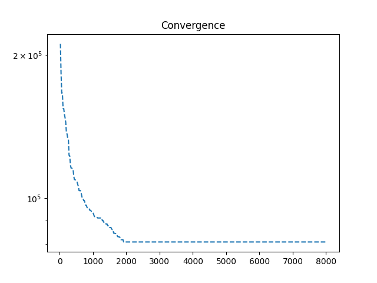

The final network is shown in Figure 4.

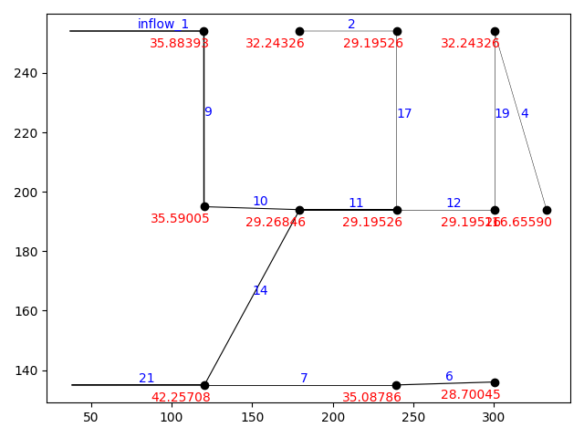

Final cost is: <b>80761.02720000001</b>

### NETWORK 2 - 14 PIPES NETWORK

This network (https://uknowledge.uky.edu/wdst_systems/9/) is given on the next Figure.

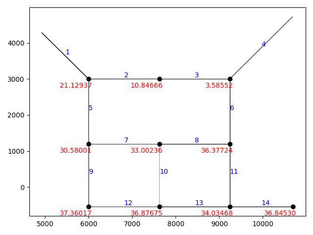

Criticality analysis of the initial network is given on the next Figure.

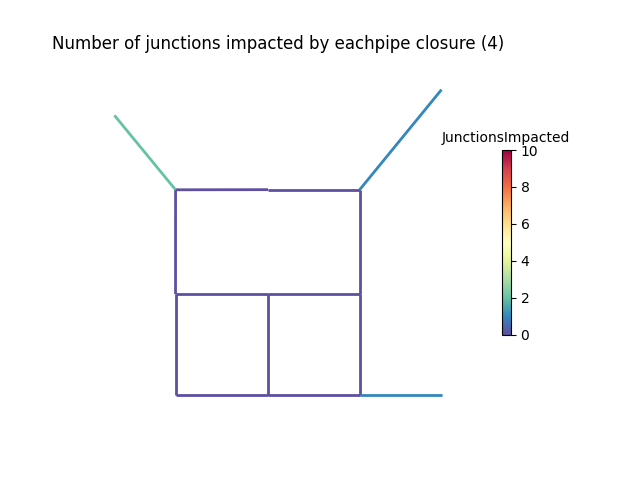

Initial cost is: <b>421828.93000000005</b>

We will first perform optimization without criticality analysis to see how well algorithm optimizes without taking in account the number of impacted junctions. Next, we will perform optimization but we will use criticality penalty to keep our network junction impact below or equal to the initial junction impact (before optimization).

Network without criticality analysis and corresponding convergence are presented on the next Figures.

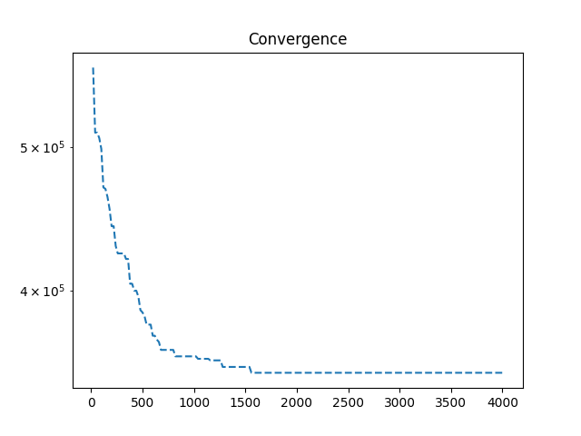

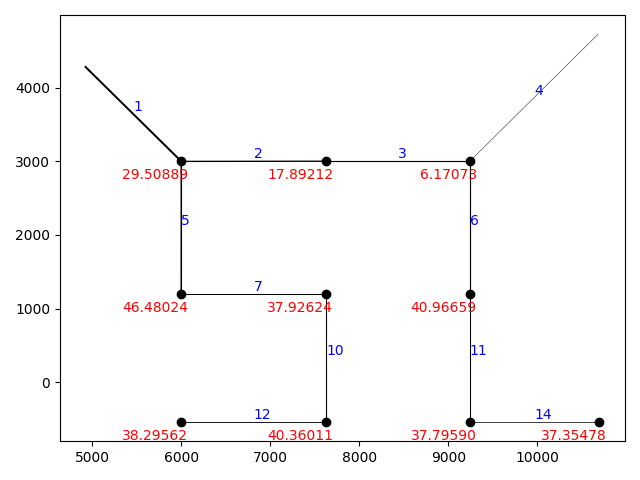

Final cost is: <b>351886.63</b>

Criticality analysis is given with next Figure.

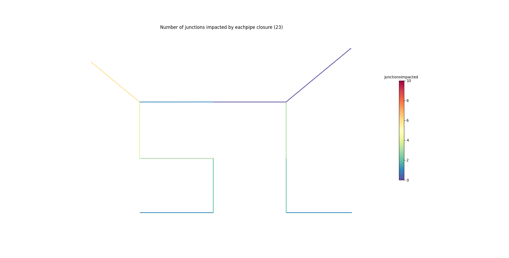

Network with criticality analysis and corresponding convergence are presented on the next Figures.

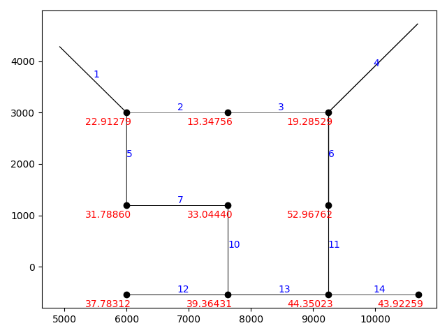

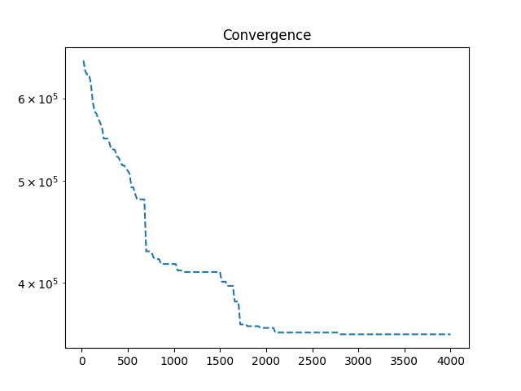

Final cost is: <b>357131.89999999997</b>

Criticality analysis is given in the next Figure.

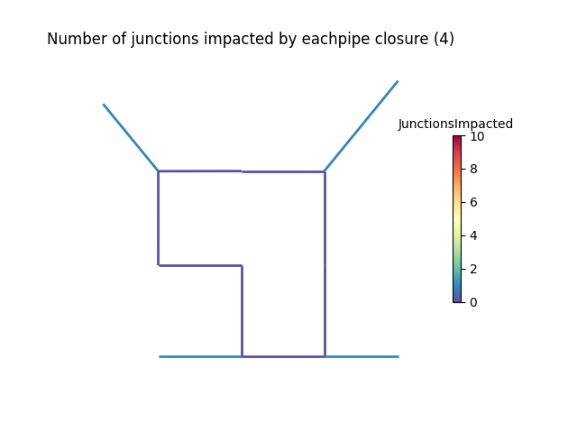

This example was run through EPANET2.2 and we obtained the same results and simulation run without problems.

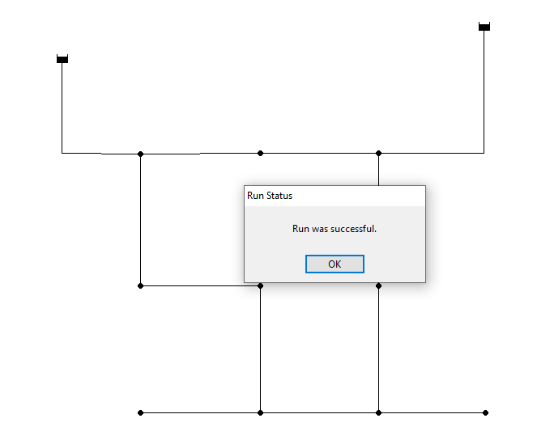

As we see the final cost is bigger in the case with criticality analysis but we maintain the desired number of impacted junctions. Pressure is maintained in the both cases.

### EXAMPLE 3 - ANYTOWN

For the third example we used the Anytown network presented on the next Figure.

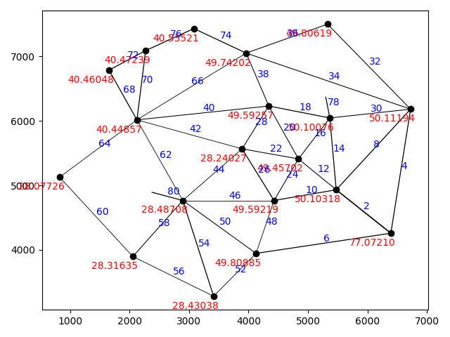

Number of impacted junctions is 0.

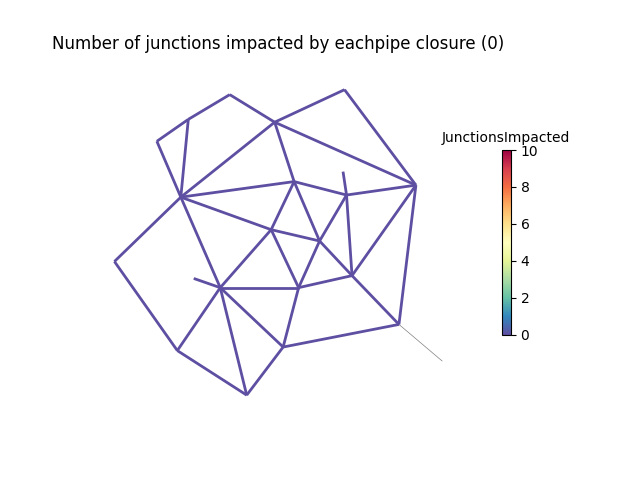

Initial cost is: <b>517497.97439999995</b>.

We performed optimization with criticality analysis and without criticality analysis.

For the first optimization case without criticality analysis we used GA with 300 generations and a population of 20 and got the following convergence plot and network layout.

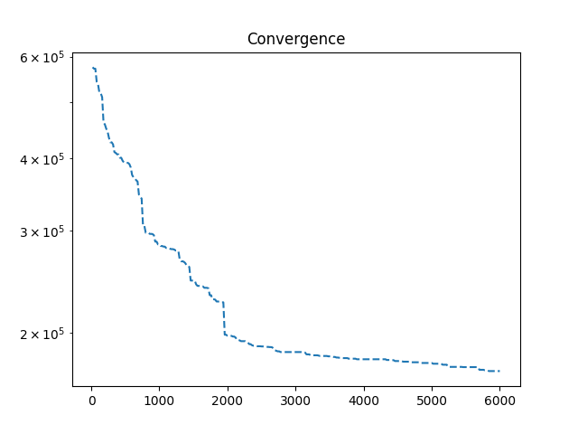

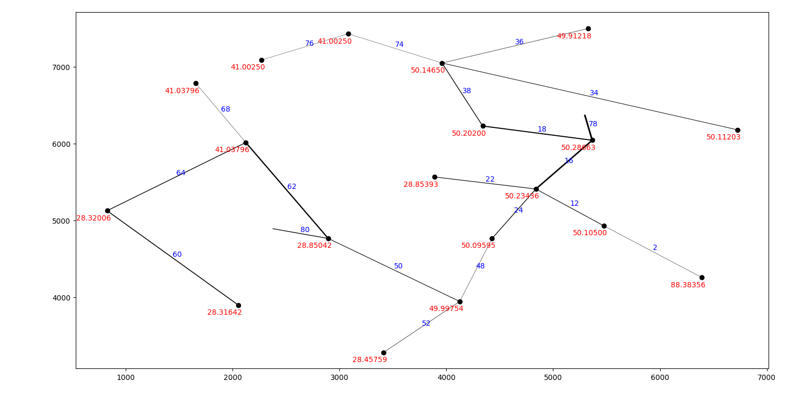

Minimum pressures are satisfied and the final cost is <b>171738.34080000003</b>. But the final junction impact is 25.

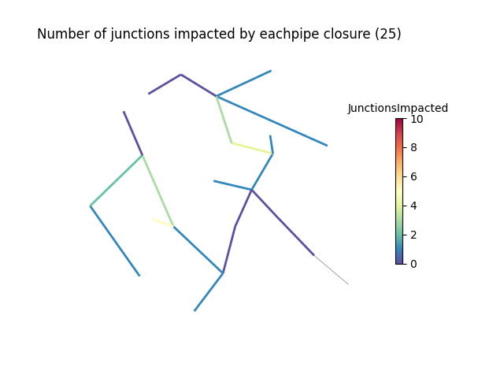

For the second part we performed optimization but with criticality analysis and a goal to obtain minimum cost while satisfying the number of impacted junctions <b>0</b> same as the initial network. For the comparison we used the same GA parameters.

The convergence plot and final layout are given on next Figures.

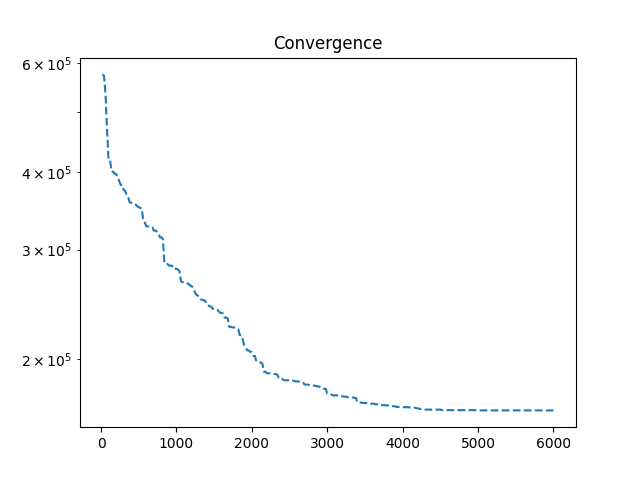

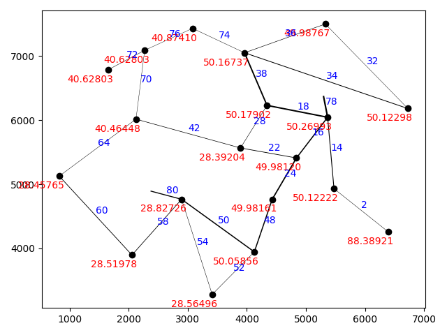

Final cost is: <b>165061.39200000005</b>.

Criticality analysis of the new layout give 0 impacted junctions.

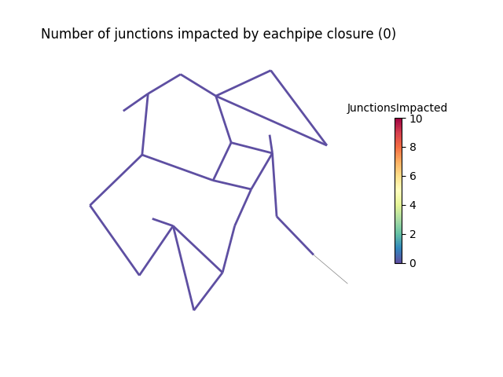

Simulations are run through Epanet2.2 without any simulation errors.